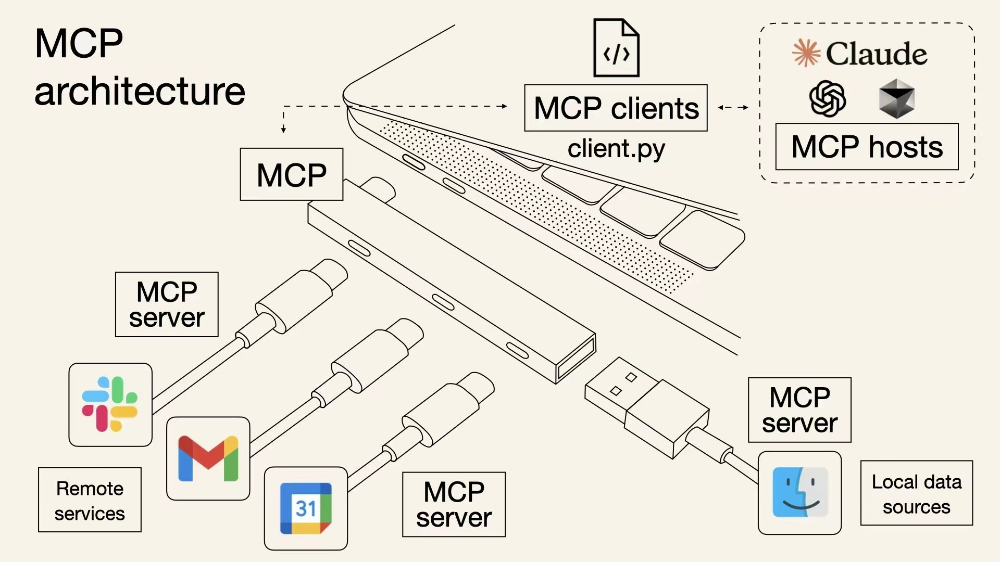
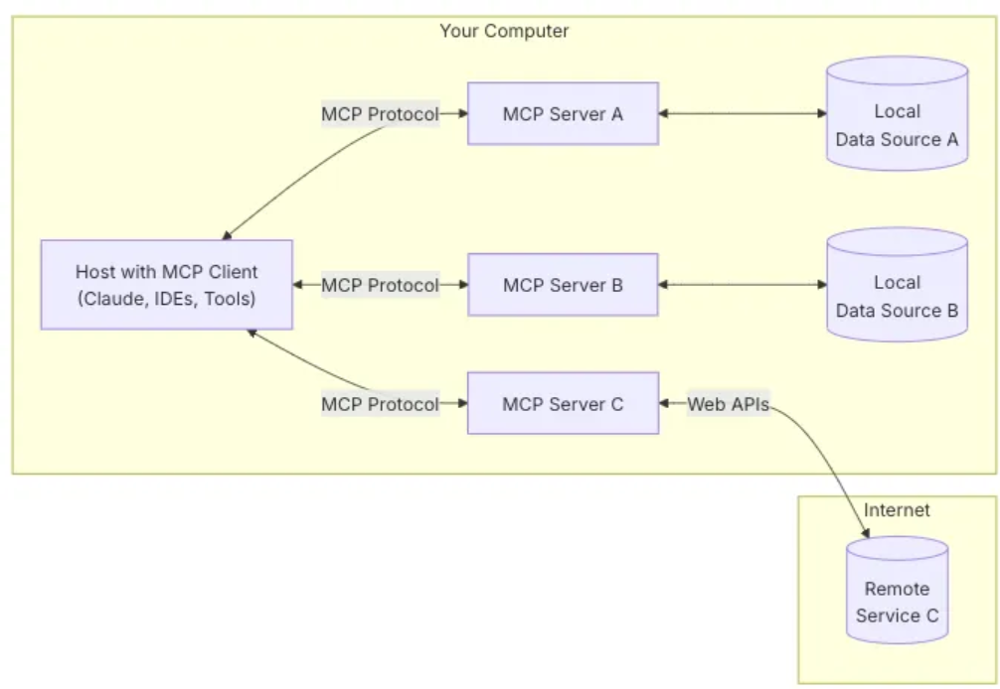

# 典型回答

MCP和Function Calling一样，都是让大模型会用工具的一种手段。全称是Model Context Protocol，顾名思义，它是一种协议，只要每一个MCP Server（工具）都遵守这个协议，那么大模型就可以直接使用这些工具了，而不需要像function calling一样，要写一大堆的适配代码（提示词）。

就像下面这张图一样，他就像一个USB的规范一样，只要大家都遵守，就能一起玩。

这个协议是 Anthropic 2024年年底推出的，就是那个研发了Claude模型的公司，他们制定的这个规范，后来因为大名鼎鼎的Cursor开始支持了，慢慢的就火起来了，后来OpenAI也不得不支持了。现在还是比较火的。

有了MCP之后，大模型就不再需要为每个数据源或工具单独开发接口，开发者只需遵循MCP规范，即可快速集成各种工具。

**MCP中有三个核心组件**

+ MCP Hosts：如Claude Desktop或IDE（比如Cursor），作为AI应用的入口，发起数据请求。
+ MCP Servers：轻量级服务，负责对接具体数据源或工具（如GitHub API、本地文件系统），提供标准化接口。（一般是别人开发好的，你要用的工具）
+ MCP Clients：协议客户端，维护与服务器的连接并转发请求。

有了MCP之后，当用户提出一个问题时，就是大致下面的流程：

1. 客户端（Claude Desktop / Cursor）将你的问题发送给大模型（如Claude）。
2. Claude 分析可用的工具，并决定使用哪一个（或多个）。
3. 客户端通过 MCP Server 执行所选的工具。
4. 工具的执行结果被送回给 Claude。
5. Claude 结合执行结果构造最终的 prompt 并生成自然语言的回应。
6. 回应最终展示给用户

