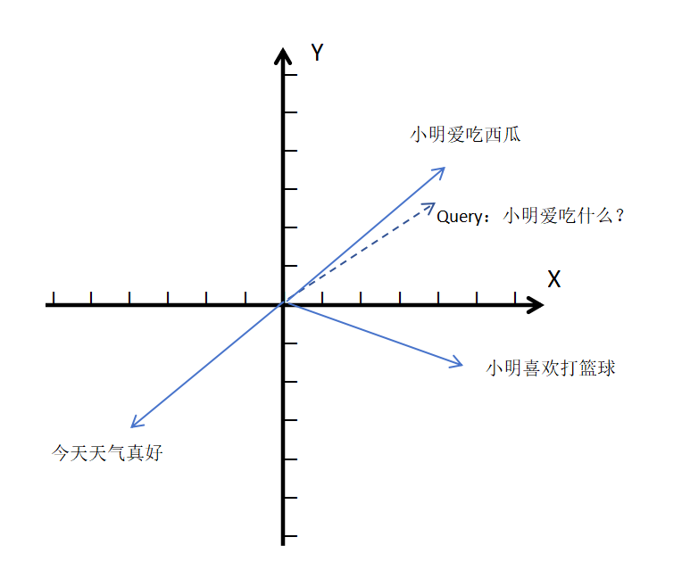

# 典型回答

向量数据库（Vector Database）是一种专门用于存储、索引和查询**高维向量数据**的数据库系统。现在AI很火，而向量数据库是实现RAG中必不可少的。

向量（Vector）其实是一个数学概念，在AI场景下，通常指将文本、图像、音频等非结构化数据通过嵌入模型转换成的数值数组（例如 [0.23, -1.45, 0.89, ...]）。这个数组能捕捉数据的语义或特征信息。

传统关系型数据库（如 MySQL）或 NoSQL 数据库（如 MongoDB）并不擅长高效处理高维向量的相似性搜索。向量数据库的核心功能是快速找到与给定向量“最相似”的其他向量，常用相似度度量包括：

    - 余弦相似度（Cosine Similarity）
    - 欧氏距离（L2 Distance）
    - 内积（Dot Product）

余弦相似度，最常用的语义相似度查询方法，主要就是看两个向量的夹角是否接近。夹角越小，向量越“同方向“，则语义越相似。

举个例子，以下面这个二维坐标系为例**（实际是多维度，为了演示方便）**，有三个已有的向量**（图中的蓝色实线向量）**，**“小明爱吃西瓜”“小明喜欢打篮球”“今天天气真好**”。我们可以从坐标系中看出，**“小明爱吃西瓜”**和**“今天天气真好”**这两个向量是完全不相关的语义，他们的余弦值就接近 -1。**“小明喜欢打篮球”**这个向量和我们的**Query向量（图中的虚线向量）“小明爱吃什么”**的夹角较大，说明它们的余弦相似度较低，语义相关程度就比较低。并且我们可以看到**Query向量“小明爱吃什么”**与**“小明爱吃西瓜”**的**“夹角”非常小**，说明两者的**余弦相似度**接近于 1，更相关。 

   
常见的向量数据库：

| 数据库 | 定位 | 特点与优势 | 局限与适用场景 | 混合检索 | 元数据过滤 | 数据规模 | 部署复杂度 |
| --- | --- | --- | --- | --- | --- | --- | --- |
| **PGvector** | PostgreSQL 扩展，向量存储与检索 | 无需新 DB，SQL + 向量混合查询方便，运维继承 PostgreSQL | 不适合超大规模（亿级以上），中小型 RAG、知识库 | 可通过应用/库支持 | 支持 | 中小（百万级） | 低 |
| **Chroma** | 轻量级向量数据库，易集成 | 开箱即用、支持内存运行、简单元数据过滤 | 不适合高并发、大规模；缺乏分布式能力 | 不支持原生混合 | 简单元数据过滤 | 小规模 | 极低 |
| **Milvus** | 云原生分布式向量数据库 | 亿级以上向量、高性能、多索引类型（HNSW/IVF等）、SDK 多语言支持 | 部署复杂，对硬件要求高 | 原生支持混合检索（稀疏+密集、多向量字段） | 支持 | 大规模（亿级以上） | 高 |
| **Qdrant** | 开源向量数据库，性能易用 | HNSW 索引、向量压缩、Rust 高效实现、支持复杂元数据过滤 | 分布式能力不如 Milvus，社区略小 | 支持部分混合检索（稀疏+密集向量组合） | 高性能元数据过滤 | 中等 | 中 |
| **Elasticsearch** | 全文检索数据库，支持向量字段 | 全文 + 向量 + 结构化检索融合，企业生态成熟 | 性能略低于原生向量库，引入成本较高 | 支持关键词 + 向量混合检索 | 支持 | 中等 | 中偏高 |

