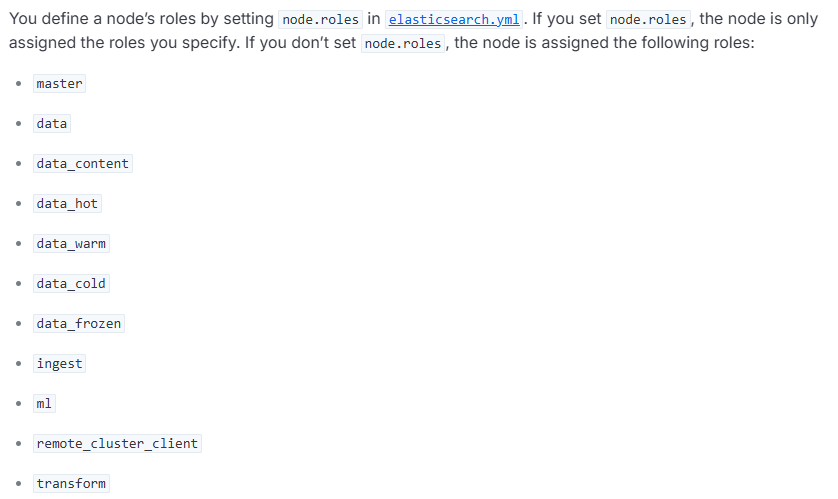
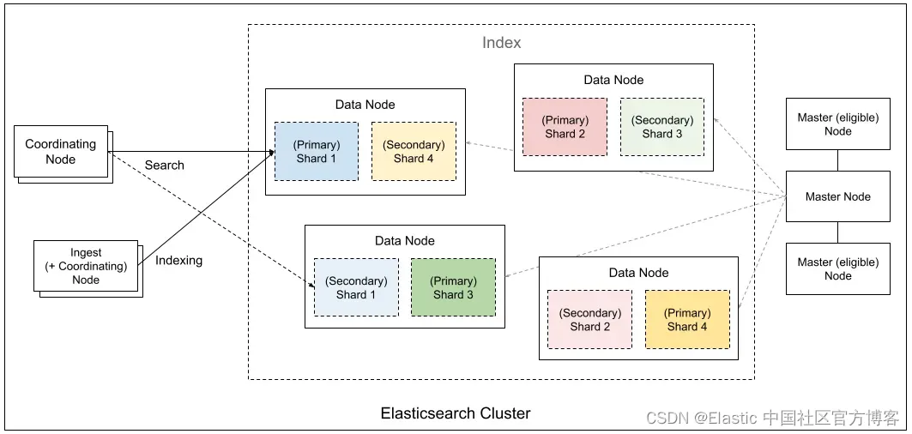

在早期版本的 ES 中，节点角色划分其实还是比较模糊的。但从 7.x 版本开始，特别是到了 8.x，ES 强烈推荐并默认使用基于角色的节点分工，来优化集群稳定性。


官方文档中有关于目前支持的node roles的介绍：[https://www.elastic.co/docs/deploy-manage/distributed-architecture/clusters-nodes-shards/node-roles](https://www.elastic.co/docs/deploy-manage/distributed-architecture/clusters-nodes-shards/node-roles)





目前支持以上这些，挑一些重点介绍下。


#### Master（主节点）
这是集群的“大脑”，负责管理集群层面的操作。主要用来管理集群状态、创建或删除索引、跟踪其他节点的加入和离开、决定分片（Shard）分配到哪个数据节点上。


+ 一个集群同时只能有一个有效主节点，通过选举产生，避免“脑裂”问题。
+ 主节点不负责与数据文档相关的操作（如索引、搜索），所以它的负载通常不高。


#### Master-eligible Node（主节点候选节点）


为了集群稳定性，通常会设置多个 主节点候选节点，它们不承担数据节点角色，以确保主节点选举的可靠性和集群管理的稳定性。通常配置为奇数个（如3、5 个） 防止脑裂。


#### Data Node（数据节点）


存储存储分片（包括主分片和副本分片）中的数据），执行CRUD 操作、搜索、聚合、排序等计算。数据节点是 CPU、内存和 I/O 密集型节点，需要强大的硬件资源。


Data Node还可以根据数据的冷热情况，进一步细分为更多角色：


+ data_hot
+ data_warm
+ data_cold
+ data_frozen


#### Coordinating Node（协调节点）


协调节点，负责接收客户端（如应用程序）的 REST 请求（搜索、写入等）。路由请求到对应 data/master 节点、以及收集各个数据节点的返回结果，进行合并、排序等最终处理，然后将最终结果返回给客户端。


所有节点只要没显式禁用，默认都是 coordinating node


#### Ingest Node（预处理节点）


在索引前对文档进行预处理，可以执行的任务包括：解析 CSV、重命名字段、添加新字段、根据条件删除数据等。


#### ML Node（机器学习节点）


专用于运行 Elasticsearch 的机器学习（ML）作业。


#### Remote Cluster Client Node（跨集群搜索节点）


用于跨集群搜索功能。


### 节点角色配置


可以在elasticsearch.yml中如下方式配置节点角色。


```plain
# 示例：专用 Master 节点
node.name: master-1
node.roles: [ master ]

# 示例：Hot Data 节点
node.name: data-hot-1
node.roles: [ data_hot, data_content ]

# 示例：专用协调节点
node.name: coordinat
```


### 典型架构


以下是ES中各个角色的关系图，来自Elastic中国官方社区。




以下是典型的es集群的配置方案。


| 节点类型 | 数量 | 角色 | 说明 |
| --- | --- | --- | --- |
| Master | 3/5 | `[master]` | 专用，低配（4C8G 即可） |
| Data Hot | N | `[data_hot, data_content]` | SSD 磁盘，高内存 |
| Data Warm | M | `[data_warm]` | 大容量 SATA，较低内存 |
| Coordinating | 2~3 | `[]` | 中高内存，处理聚合结果 |
| Ingest | 可选 | `[ingest]` | 若大量使用 pipeline |


