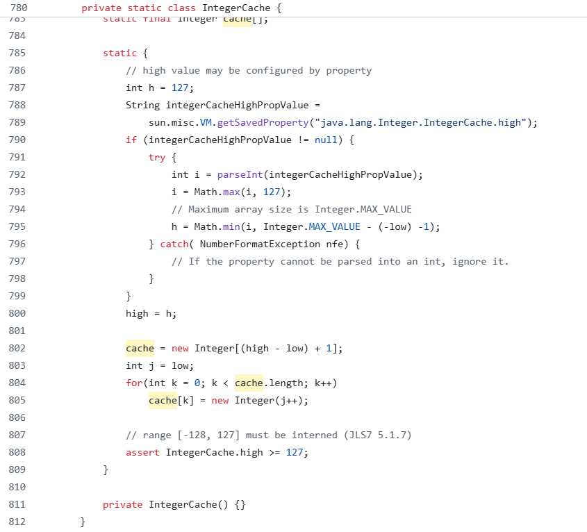

# 典型回答


这个问题其实考察的是**java中包装类的缓存机制**。先说答案。


```java
Integer a = 1000;
Integer b = 1000;
System.out.println(a == b); // false

Integer c = 100;
Integer d = 100;
System.out.println(c == d); // true
```


Java 中的**包装类缓存机制**，主要是指 Java 对部分包装类（如 `Integer`, `Byte`, `Short`, `Long`, `Character`, `Boolean`）在**一定范围内的数值**使用了**缓存池**，以提升性能、节省内存。  Java 对**以下包装类**中的**部分数值**进行了缓存：


| 包装类 | 缓存范围 |
| --- | --- |
| `Integer` | `[-128, 127]` |
| `Short` | `[-128, 127]` |
| `Byte` | `[-128, 127]` |
| `Long` | `[-128, 127]` |
| `Character` | `[0, 127]` |
| `Boolean` | `true`, `false` |


注意：**Float、Double不支持缓存。我猜测可能是小数太多了，没办法穷举。**


当我们在代码中写下`Integer a = 100;`的时候，实际上调用的是`Integer a = Integer.valueOf(127);`（自动装箱）


那么，可以看下Integer.valueOf的源码（以1.8为例）：


```java
public static Integer valueOf(int i) {
    if (i >= IntegerCache.low && i <= IntegerCache.high)
        return IntegerCache.cache[i + (-IntegerCache.low)];
    return new Integer(i);
}
```


也就说，他会先判断这个`i`数字，是不是在`IntegerCache.low`和`IntegerCache.high`之间，如果是的话，则从IntegerCache中获取，否则在new一个新的。


这里的IntegerCache是个内部类，看一下前面用到的low、high和cache都是啥：

```java
 private static class IntegerCache {
        static final int low = -128;
        static final int high;
        static final Integer cache[];
        static {
            // high value may be configured by property
            int h = 127;
            //省略其余代码
        }
 }
```


可以看到，low是-128，hign是127，也就意味着如果你要创建的一个数字，范围在-128到127之间（包含这两个数字本身），那么他就不会重复创建对象，而是从`Integer cache[]`这个整型数组中取出来。


**(因为100在这个范围内，所以创建多次他都用的是同一个，而1000不在这个范围内，所以每次都会new一个，而==对比的是地址，所以new出来的对象的地址是不一样的，缓存中的地址就是同一个）**


而这个`Integer cache[]`数组，会在刚开始就初始化好，代码如下：





同理，和Integer一样，其他的数据类型如Short、Boolean、Long等也有，范围在上面的表格中写了的。


默认的缓存范围也**可以调整**，可以通过`-Djava.lang.Integer.IntegerCache.high=200`的方式来设定上限，但是下限是不能调整的，这部分通过上面我贴的代码也能看得出来，就不展开说了。


