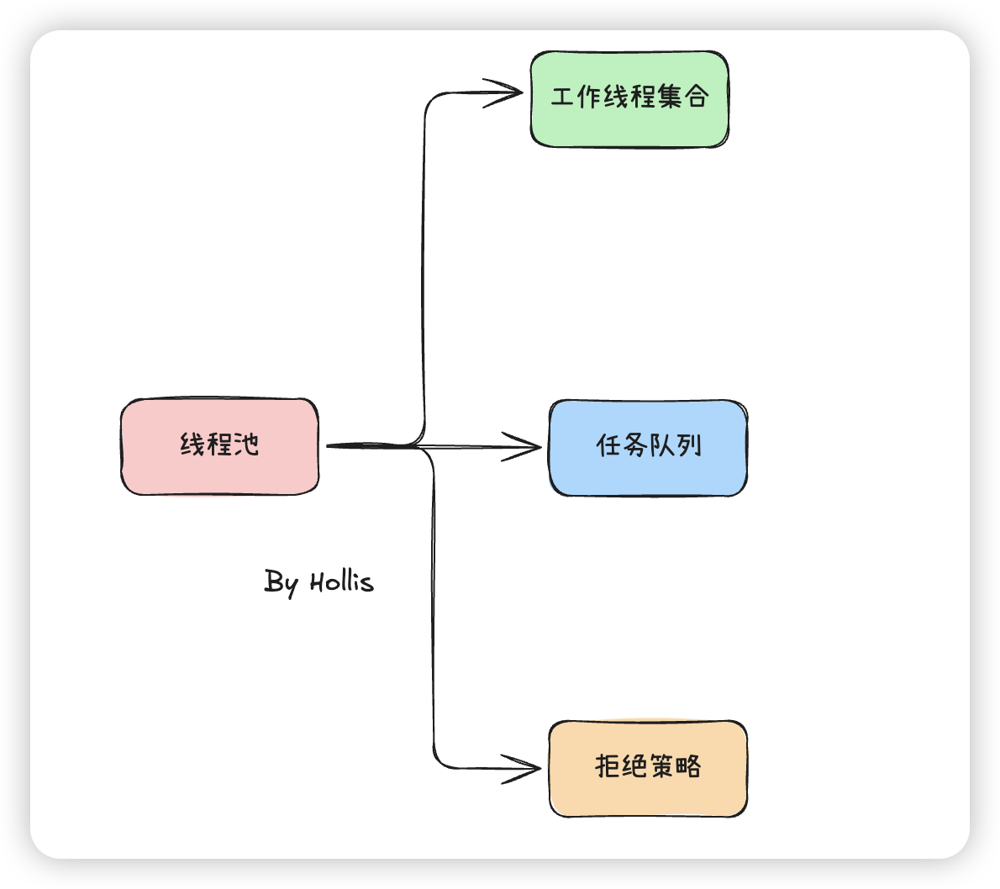
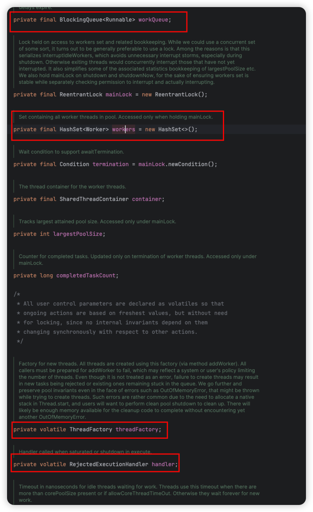
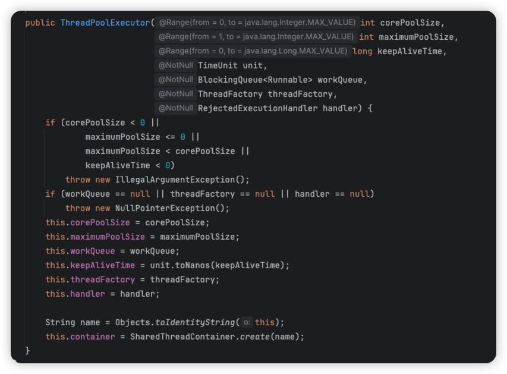
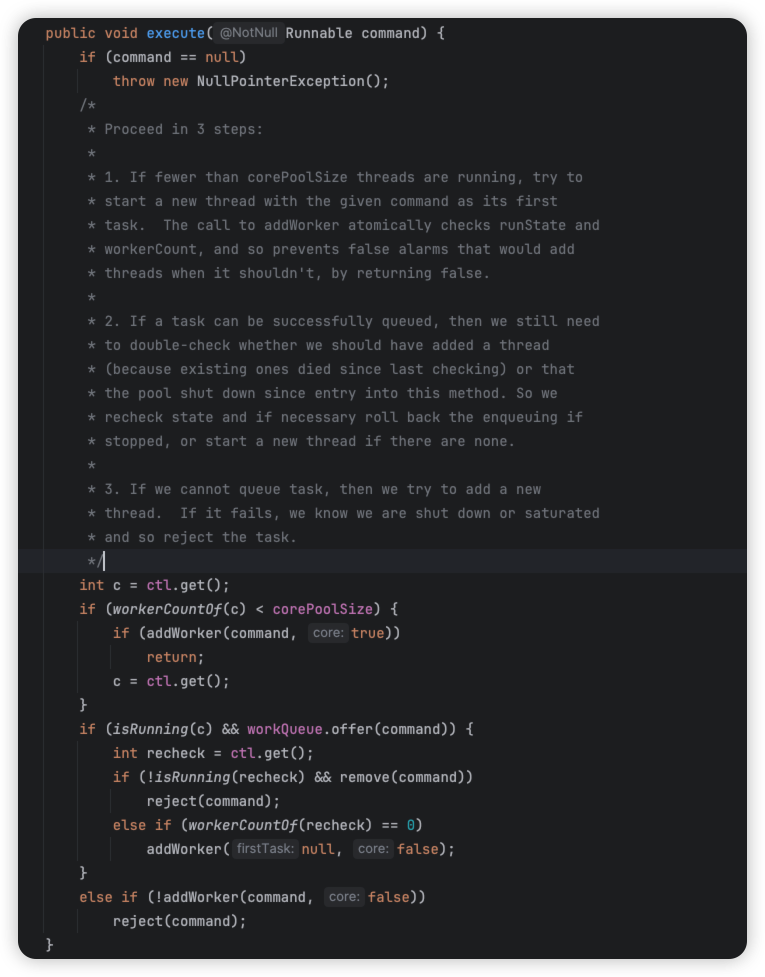
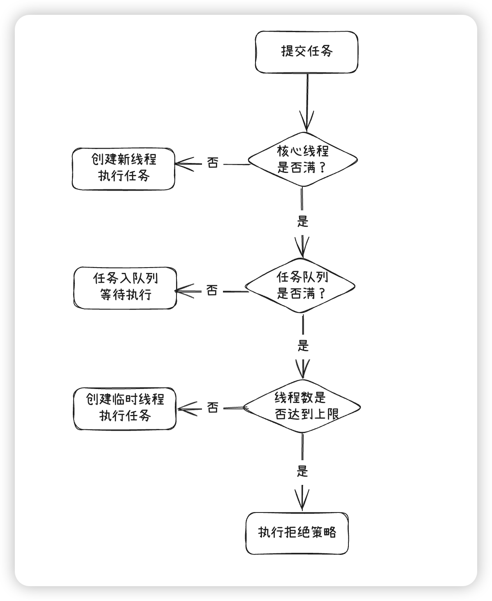
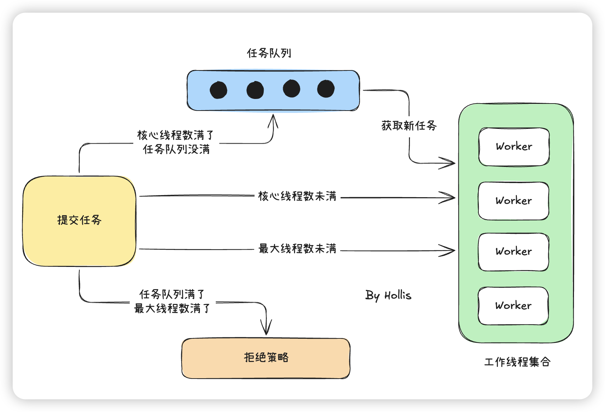

# 典型回答


线程池是池化技术的一种典型实现，所谓池化技术就是提前保存大量的资源，以备不时之需。在机器资源有限的情况下，使用池化技术可以大大的提高资源的利用率，提升性能等。


线程池，说的就是提前创建好一批线程，然后保存在线程池中，当有任务需要执行的时候，从线程池中选一个线程来执行任务。这样可以避免频繁创建和销毁线程的开销。


在编程领域，比较典型的池化技术有：


线程池、连接池、内存池、对象池等。


Java中线程池的继承关系如下：


Java中的线程池都继承自ExecutorService这个接口，具体的实现上有两种线程池，分别加ThreadPoolExetutor和ForkJoinPool。本文主要讲的是ThreadPoolExetutor（本文代码基于JDK 21，旧版可能有略微差异，但是逻辑都一样），关于ForkJoinPool可以看：


[✅ForkJoinPool和ThreadPoolExecutor区别是什么？](docs/Java并发/✅ForkJoinPool和ThreadPoolExecutor区别是什么？.md)


### 线程池的实现原理


不管是上面的哪个方法创建线程池，都是通过ThreadPoolExecutor的构造函数来创建的线程池（除ForkJoinPool类线程池外）。其实线程池是一个很复杂的结构，简单点说他有3部分组成。





对应到代码（ThreadPoolExecutor）中，就是以下这和几个：





+ 任务队列（workQueue）：是一个BlockingQueue<Runnable>，负责缓存待执行的任务。
+ 工作线程集合（workers）：是一个HashSet<Worker>，负责管理所有工作线程的生命周期。
+ 拒绝策略（handler）:是一个RejectExecutionHandler，用来定义如何处理无法执行的任务。


#### Worker


这里还有个Worker的概念很重要，Worker是实现了 `Runnable` 接口的。每个 `Worker` 对象会包含一个任务和一个线程：

+ **任务**（`Runnable firstTask`）：任务就是我们提交给线程池要执行的那个任务（Runnable类型），也就是说一个任务如果想被执行，都必须要变成一个Worker。
+ **线程**（`Thread thread`）：`Worker` 会有一个线程来执行它的任务。这个线程是由 `ThreadPoolExecutor` 创建并管理的。


```java
Worker(Runnable firstTask) {
    setState(-1); // inhibit interrupts until runWorker
    this.firstTask = firstTask;
    this.thread = getThreadFactory().newThread(this);
}
```


每个 `Worker` 对象都会持有一个任务（`firstTask`）。当 `Worker` 被创建时，它会通过构造函数接收一个 `Runnable` 类型的任务。但是Worker并不是执行完这个任务就结束了，而是会继续从任务队列中取任务并执行，直到线程池关闭或任务队列为空。


`Worker` 中有一个 `Thread` 对象，它表示实际执行任务的工作线程。每个 `Worker` 都会拥有一个线程，线程会执行 `run()` 方法中的任务。


> 在 `run()` 方法中，`Worker` 反复执行 `runTask(firstTask)` 来执行任务。执行完一个任务后，`Worker` 会继续检查线程池的状态（`runStateAtLeast(ctl.get(), SHUTDOWN)`）并获取新的任务，直到线程池关闭。
>


#### 线程池初始化参数


通常，一般构造函数会反映出这个工具或这个对象的数据存储结构。




介绍下这些参数的意思。

 

+  corePoolSize: 核心线程数量，可以类比正式员工数量，常驻线程数量。 
+  maximumPoolSize: 最大的线程数量，公司最多雇佣员工数量。常驻+临时线程数量。 
+  workQueue：多余任务等待队列，再多的人都处理不过来了，需要等着，在这个地方等。 
+  keepAliveTime：非核心线程空闲时间，就是外包人员等了多久，如果还没有活干，解雇了。 
+  threadFactory: 创建线程的工厂，在这个地方可以统一处理创建的线程的属性。每个公司对员工的要求不一样，恩，在这里设置员工的属性。 
+  handler：线程池拒绝策略，什么意思呢？就是当任务实在是太多，人也不够，需求池也排满了，还有任务咋办？默认是不处理，抛出异常告诉任务提交者，我这忙不过来了。 


#### 添加任务过程


接着，我们看一下线程池中比较重要的execute方法，该方法用于向线程池中添加一个任务。




1、首先，线程池会检查当前线程池中是否有空闲线程来执行这个任务。如果当前线程池中正在运行的线程数少于**核心线程数** (`corePoolSize`)，线程池会立即创建一个新线程来执行任务。通过调用 `addWorker(command, true)` 方法来创建新线程并执行任务。


2、如果当前线程池的工作线程数已经达到核心线程数，且所有线程都在忙碌工作，那么接下来的任务会被放入任务队列中，等待线程执行。线程池会将任务提交到队列，使用 `offer()` 方法将任务放入队列中


3、如果队列已经满了，且当前线程池中的线程数少于**最大线程数** (`maximumPoolSize`)，线程池会尝试创建新的线程来执行任务。


4、如果线程池的线程数已经达到最大线程数（`maximumPoolSize`），并且任务队列也已满，那么线程池就会执行拒绝策略。


这里逻辑稍微有点复杂，画了个流程图仅供参考。





再通过这个流程，我们把前面说过的线程池的三个关键角色串联起来：





接下来，我们看看如何添加一个工作线程（Worker）的？


#### 创建新线程并执行任务


从方法execute的实现可以看出，addWorker主要负责创建新的线程并执行任务，那么这个过程的具体逻辑是怎么样的呢？


我在下面的源码中增加了注释，方便大家理解

```java
private boolean addWorker(Runnable firstTask, boolean core) {
        // 省略一堆前置检查

        // 1.创建线程
        boolean workerStarted = false;
        boolean workerAdded = false;
        Worker w = null;
        try {
            //创建一个新的 Worker 对象
            //Worker 是 ThreadPoolExecutor 内部的一个类，负责执行任务。
        	//firstTask 是传递给 Worker 的第一个任务
            w = new Worker(firstTask);
            //新创建的线程对象，接下来会用这个线程来执行任务。
            final Thread t = w.thread;
            if (t != null) {
                final ReentrantLock mainLock = this.mainLock;
                //由于线程池需要保持对工作线程集合（workers）的同步访问
                //线程池会使用一个锁来保护这个部分。
                mainLock.lock();
                try {
                    // Recheck while holding lock.
                    // Back out on ThreadFactory failure or if
                    // shut down before lock acquired.
                    int c = ctl.get();
                	//判断线程池是否处于运行状态（RUNNING）。如果线程池没有关闭并且任务是有效的，允许添加工作线程。
                    if (isRunning(c) ||
                        (runStateLessThan(c, STOP) && firstTask == null)) {
                        //确保新创建的线程的状态是 NEW，即尚未开始执行。
                        if (t.getState() != Thread.State.NEW)
                            throw new IllegalThreadStateException();
                        //将 Worker 添加到线程池的工作线程集合中
                        workers.add(w);
                        workerAdded = true;
                        int s = workers.size();
                        if (s > largestPoolSize)
                            //更新 largestPoolSize，记录线程池中最大线程数，方便监控线程池的负载情况。
                            largestPoolSize = s;
                    }
                } finally {
                    mainLock.unlock();
                }
                if (workerAdded) {
                    //启动工作线程
                    container.start(t);
                    workerStarted = true;
                }
            }
        } finally {
            if (! workerStarted)
                addWorkerFailed(w);
        }
        return workerStarted;
    }

```


首先是先做一些前置检查，代码我没贴，大家可以直接看源码，主要就是确保线程池处于可以添加线程的状态，避免在关闭状态下添加线程。并且使用CAS操作确保在多线程环境下线程池的工作线程数量不会溢出。


然后就是创建新的 `Worker` 对象并启动线程执行任务，并更新线程池中当前工作线程的集合，保持线程池的状态一致。


# 扩展知识


## <font style="color:rgb(51, 51, 51);">核心线程数已经占满了，如果来了新的任务会怎么处理？</font>
前面其实讲过了，按照那个流程来看的话，先尝试把任务放进工作队列（workQueue）

+ 只要工作队列没满，新任务就会在队列中排队等待，不会创建新线程，也不会被拒绝。
+ 只有当队列也满了，才会考虑创建超过核心线程数的线程（最多到 `maximumPoolSize`）。
+ 如果连 `maximumPoolSize` 也达到了，且队列满，才会拒绝任务。

