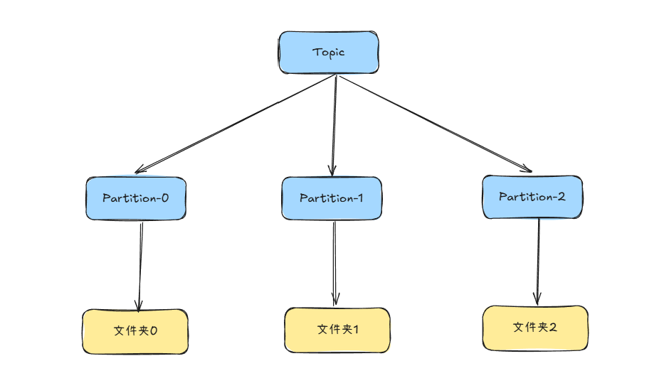
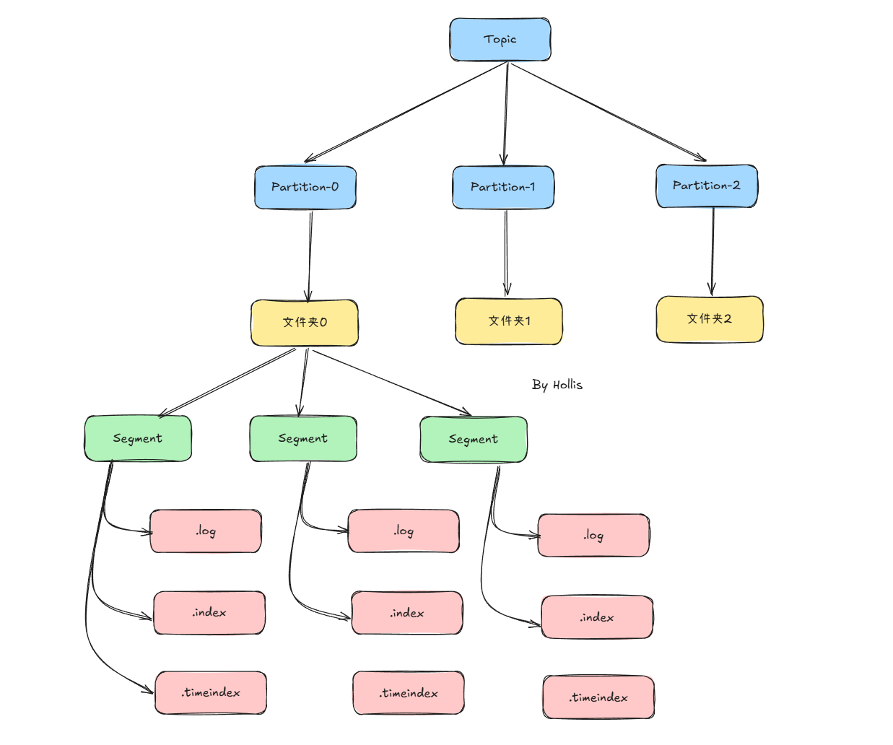

# 典型回答


<font style="color:rgb(64, 64, 64);">Kafka 的存储理念非常简洁：</font>**<font style="color:rgb(64, 64, 64);">它将所有收到的消息简单地以顺序追加（Append-Only）的方式写入磁盘文件。</font>**<font style="color:rgb(64, 64, 64);"> 这种利用</font>**<font style="color:rgb(64, 64, 64);">顺序磁盘 I/O</font>**<font style="color:rgb(64, 64, 64);"> 的方式，这也是kafka性能好的重要原因之一。</font>

<font style="color:rgb(64, 64, 64);"></font>

[✅Kafka 为什么这么快？](docs/Kafka/✅Kafka 为什么这么快？.md)


<font style="color:rgb(64, 64, 64);">Kafka 的存储结构是一个从逻辑概念到物理文件的层级映射关系：</font>

<font style="color:rgb(64, 64, 64);"></font>

**<font style="color:rgb(64, 64, 64);">逻辑概念：</font>**`**<font style="color:rgb(64, 64, 64);background-color:rgb(236, 236, 236);">Topic</font>**`**<font style="color:rgb(64, 64, 64);"> </font>****<font style="color:rgb(64, 64, 64);">-></font>****<font style="color:rgb(64, 64, 64);"> </font>**`**<font style="color:rgb(64, 64, 64);background-color:rgb(236, 236, 236);">Partition</font>**`<font style="color:rgb(64, 64, 64);">  
</font>**<font style="color:rgb(64, 64, 64);">物理文件：</font>**`**<font style="color:rgb(64, 64, 64);background-color:rgb(236, 236, 236);">Partition</font>**`**<font style="color:rgb(64, 64, 64);"> </font>****<font style="color:rgb(64, 64, 64);">-></font>****<font style="color:rgb(64, 64, 64);"> </font>**`**<font style="color:rgb(64, 64, 64);background-color:rgb(236, 236, 236);">Log Segment</font>**`**<font style="color:rgb(64, 64, 64);"> </font>****<font style="color:rgb(64, 64, 64);">文件</font>**

**<font style="color:rgb(64, 64, 64);"></font>**

1. **<font style="color:rgb(64, 64, 64);">Topic</font>**<font style="color:rgb(64, 64, 64);">：逻辑上的消息分类，相当于消息队列的名字</font>
2. **<font style="color:rgb(64, 64, 64);">Partition</font>**<font style="color:rgb(64, 64, 64);">： Topic 下会划分多个分区，每个分区对应一个有序、不可变的消息队列。这是 Kafka </font>**<font style="color:rgb(64, 64, 64);">并行处理</font>**<font style="color:rgb(64, 64, 64);">和</font>**<font style="color:rgb(64, 64, 64);">水平扩展</font>**<font style="color:rgb(64, 64, 64);">的基础。</font>
    - <font style="color:rgb(64, 64, 64);">在物理上，</font>**<font style="color:rgb(64, 64, 64);">每个 Partition 对应磁盘上的一个文件夹</font>**<font style="color:rgb(64, 64, 64);">。</font>


```plain
/tmp/kafka-logs/
├── my-topic-0/           # Partition 0 对应的文件夹
├── my-topic-1/           # Partition 1 对应的文件夹
├── my-topic-2/           # Partition 2 对应的文件夹
└── ...
```





### Segment


<font style="color:rgb(64, 64, 64);">虽然每个 Partition 是一个逻辑上的日志，但物理上它并不会被存储为一个巨大的文件，而是被</font>**<font style="color:rgb(64, 64, 64);">切割成多个大小相等的 Segment 文件</font>**<font style="color:rgb(64, 64, 64);">。</font>**<font style="color:rgb(64, 64, 64);">便于过期数据的删除、提升查找效率。</font>**


每个 segment 包含两类文件（同名不同后缀）：


1. 日志数据文件（.log）
    - 存储消息本体，采用顺序写，性能极高（磁盘顺序写接近内存速度）。
    - 文件名是该 segment 第一条消息的 offset，比如：

```plain
/tmp/kafka-logs/
├── my-topic-0/           # Partition 0 对应的文件夹
│   ├── 00000000000000000000.log
│   └── leader-epoch-checkpoint
├── my-topic-1/           # Partition 1 对应的文件夹
│   ├── 00000000000000000000.log
└── ...
```

2. 索引文件（.index / .timeindex）
    - `.index`：offset 索引，存储相对 offset 与物理位置的映射。
    - `.timeindex`：时间索引，存储消息时间戳与物理位置的映射。
    - 便于快速查找消息位置。


```plain
/tmp/kafka-logs/
├── my-topic-0/           # Partition 0 对应的文件夹
│   ├── 00000000000000000000.index
│   ├── 00000000000000000000.log
│   ├── 00000000000000000000.timeindex
│   ├── 00000000000000000005.index
│   ├── 00000000000000000005.log
│   ├── 00000000000000000005.timeindex
│   └── leader-epoch-checkpoint
├── my-topic-1/           # Partition 1 对应的文件夹
│   ├── 00000000000000000000.index
│   ├── 00000000000000000000.log
│   ├── ...
│   └── leader-epoch-checkpoint
└── ...
```


> `**<font style="color:rgb(64, 64, 64);background-color:rgb(236, 236, 236);">leader-epoch-checkpoint</font>**`<font style="color:rgb(64, 64, 64);">：用于存储 Leader Epoch 信息，主要用于防止数据丢失和保证数据一致性，与事务和副本同步相关。</font>
>


### 整体结构


了解了上面的内容之后，就可以画出一张Kafka的数据存储的结构图了：





### <font style="color:rgb(64, 64, 64);">消息的写入与读取流程</font>
#### <font style="color:rgb(64, 64, 64);">写入（生产者）</font>
1. <font style="color:rgb(64, 64, 64);">生产者发送消息到指定 Topic 的 Partition。</font>
2. <font style="color:rgb(64, 64, 64);">Broker 接收到消息后，将其</font>**<font style="color:rgb(64, 64, 64);">顺序追加</font>**<font style="color:rgb(64, 64, 64);">到该 Partition 当前活跃的 Segment（即最新的那个</font><font style="color:rgb(64, 64, 64);"> </font>`**<font style="color:rgb(64, 64, 64);background-color:rgb(236, 236, 236);">.log</font>**`<font style="color:rgb(64, 64, 64);"> </font><font style="color:rgb(64, 64, 64);">文件）的末尾。</font>
3. <font style="color:rgb(64, 64, 64);">只有当消息被写入磁盘（根据配置，可以是刷盘也可以是 PageCache）后，这次写入才被认为是成功的。</font>


#### <font style="color:rgb(64, 64, 64);">读取（消费者）</font>
1. <font style="color:rgb(64, 64, 64);">消费者指定要消费的 Topic、Partition 以及 Offset。</font>
2. <font style="color:rgb(64, 64, 64);">Broker 根据 Offset 找到对应的 Segment 文件（通过文件名快速定位）。</font>
3. <font style="color:rgb(64, 64, 64);">使用该 Segment 的</font><font style="color:rgb(64, 64, 64);"> </font>`**<font style="color:rgb(64, 64, 64);background-color:rgb(236, 236, 236);">.index</font>**`<font style="color:rgb(64, 64, 64);"> </font><font style="color:rgb(64, 64, 64);">文件，快速定位到该 Offset 在</font><font style="color:rgb(64, 64, 64);"> </font>`**<font style="color:rgb(64, 64, 64);background-color:rgb(236, 236, 236);">.log</font>**`<font style="color:rgb(64, 64, 64);"> </font><font style="color:rgb(64, 64, 64);">文件中的大致物理位置。</font>
4. <font style="color:rgb(64, 64, 64);">从该物理位置开始，在</font><font style="color:rgb(64, 64, 64);"> </font>`**<font style="color:rgb(64, 64, 64);background-color:rgb(236, 236, 236);">.log</font>**`<font style="color:rgb(64, 64, 64);"> </font><font style="color:rgb(64, 64, 64);">文件中进行顺序扫描，直到找到精确的消息。</font>
5. <font style="color:rgb(64, 64, 64);">将消息发送给消费者。</font>

