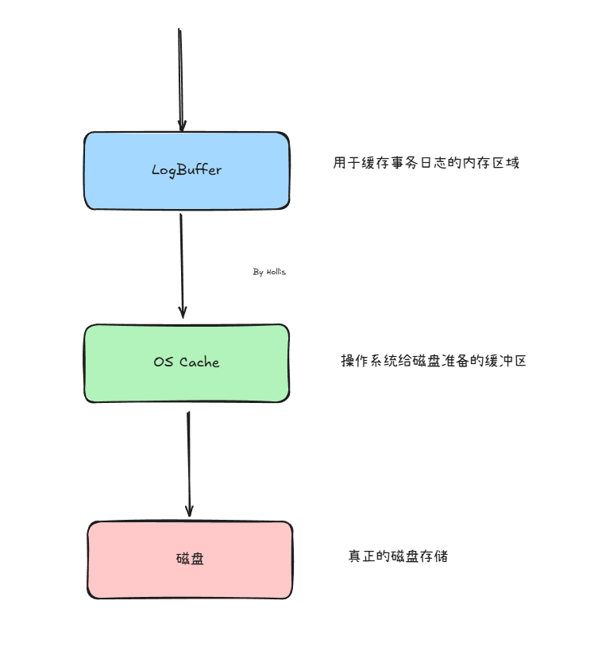

# 典型回答

这种绝对性的问题，答案肯定是不能的。

首先，MySQL有很多引擎，其中一部分是基于磁盘的，比如Innodb，Myisam等，但是也有基于内存的，比如Memory，而基于内存的这种如果断电了，可能就丢数据了。

那么，基于磁盘的就万无一失了么？其实也不是。

日志要写入磁盘要经过几个过程：

如果你看过下面这篇文章，你会知道，MySQL为了保证数据不丢，在事务写入的时候做了2阶段提交。

[✅什么是事务的2阶段提交？](docs/MySQL/✅什么是事务的2阶段提交？.md)

这里面画图的时候其实是考虑的**默认情况**的，啥意思呢，先来看2个MySQL的参数。

`innodb_flush_log_at_trx_commit`是MySQL InnoDB存储引擎独有的参数，用于控制InnoDB的Redo log日志记录方式。取值范围为0、1、2：

+ 0：只写入LogBuffer，不会把Redo日志写入磁盘，而是靠InnoDB的后台线程每秒写入磁盘。
+ **1（默认值）：写入LogBuffer，并立即将LogBuffer数据写入磁盘缓冲区并刷盘。**
+ 2：写入LogBuffer，并立即将Redo日志写入操作系统的磁盘缓冲区，每秒由操作系统调度刷盘一次。

`sync_binlog`是MySQL Binlog日志的重要参数，用于控制Binlog的更新策略。取值范围 0、1 或 N（正整数）：

+ 0：事务提交后仅将Binlog写入文件系统缓存，依赖操作系统调度刷盘。
+ **1（默认值）：每次事务提交后立即将Binlog写入磁盘。**
+ **>1：每N个事务提交后，立即将Binlog写入磁盘。**

****

那么也就是说，如果你了解操作系统的write和fsync指令的话，翻译一下就是这样的：

[✅write和fsync的区别是什么？](docs/操作系统/✅write和fsync的区别是什么？.md)

| | `**innodb_flush_log_at_trx_commit = 1**` | `**innodb_flush_log_at_trx_commit = 0**` | `**innodb_flush_log_at_trx_commit = 2**` |
| --- | --- | --- | --- |
| **动作** | **写LogBuffer** `**write()**`** 到 OS  Cache** `**fsync()**`** 到磁盘** | **写LogBuffer** | **写 Log Buffer****   **`**write()**`** 到 OS Cache** |

| | `**sync_binlog**** = 1**` | `**sync_binlog**** = 0**` | `**sync_binlog**** > 1**` |
| --- | --- | --- | --- |
| **动作** | **写LogBuffer** `**write()**`** 到 OS  Cache** `**fsync()**`** 到磁盘** | **写LogBuffer** | **写LogBuffer** **每 **`**N**`** 个事务提交后，才将 binlog **`**write()**`** 到 Page Cache 并执行 **`**fsync()**`** 到刷盘。** |

那么也就意味着，如果你想让数据不丢，至少要把`innodb_flush_log_at_trx_commit`和`sync_binlog`都设置为1，让他们立刻写入磁盘并刷盘。

但是，这样只是能极大程度上保证不丢，在一些极端情况下还是会丢的。

### 丢数据的情况

fsync 只是请求刷盘，不一定真正落到“磁盘介质”

+ 有些硬盘或 RAID 控制器会“欺骗 fsync” —— 把数据写入自己的缓存里，但并未真正写入磁盘。
+ 如果掉电或主板故障，**缓存数据就丢了**。

写缓存未关闭

+ 如果设备层还是启用了缓存（如 `write-back cache`），操作系统或数据库认为“写入完成”，但数据仍只在硬件缓存中。

电源断电 / 非正常宕机时

+ 如果没有使用 UPS（不间断电源）或 BBU（电池保护的 RAID），哪怕你调用了 `fsync`，掉电依然可能导致数据丢失。

磁盘损坏

+ 如果磁盘本身发生物理损坏，比如坏道、芯片失效，那么写入其上的数据自然就丢失了。

### 如何提升不丢的保障

根据上面的情况，其实还是可以想办法解决和避免的。

1、配置 `innodb_flush_log_at_trx_commit=1` 和 `sync_binlog=1`

2、为数据库服务器配备带电池备份 (BBU) 的RAID卡 或 支持掉电保护的SSD。

3、使用RAID 10来做备份和冗余。

> RAID，Redundant Array of Independent Disks是一种通过将多个物理硬盘组合起来形成一个逻辑存储单元的技术  
>
> 
>
> BBU, Battery Backup Unit（电池备份单元） ，是 RAID 控制卡上的关键组件，用于 保护 RAID 缓存数据，防止因意外断电导致数据丢失或损坏。
>
> 
>
> RAID 10（也称为 RAID 1+0）是 高性能 + 高可靠性 的存储方案。
>

