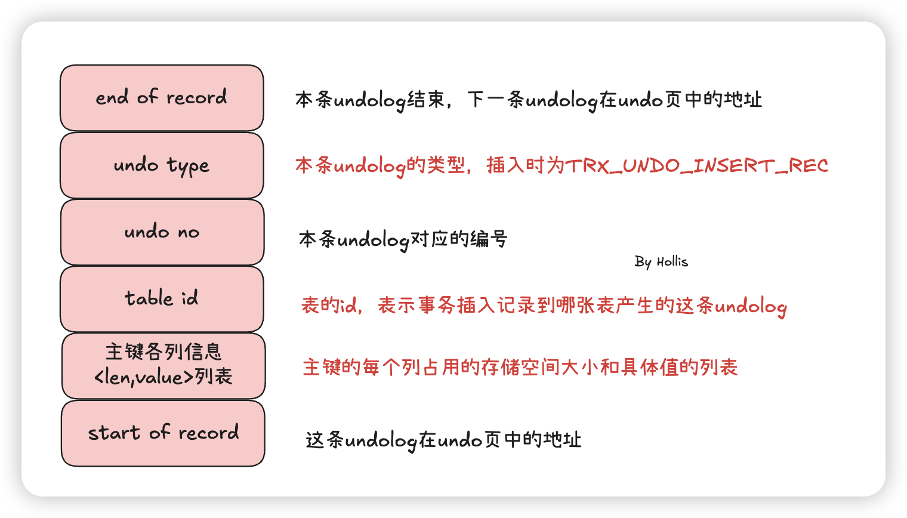

# 典型回答


现需要了解下这几种log：


[✅binlog、redolog和undolog区别？](docs/MySQL/✅binlog、redolog和undolog区别？.md)


**redolog**：**是MySQL用于实现崩溃恢复和数据持久性的一种机制。**在事务进行过程中，MySQL会将事务<u>做了什么改动</u>到Redo Log中。当系统崩溃或者发生异常情况时，MySQL会利用Redo Log中的记录信息来进行恢复操作，将事务所做的修改持久化到磁盘中。

**binlog**：是MySQL用于记录数据库中的所有DDL语句和DML语句的一种二进制日志。它记录了所有对数据库结构和数据的修改操作，如INSERT、UPDATE和DELETE等。**binlog主要用来对数据库进行数据备份、灾难恢复和数据复制等操作**。binlog的格式分为基于语句的格式和基于行的格式。

**undolog**：**用于在事务回滚或系统崩溃时撤销（回滚）事务所做的修改。**当一个事务执行过程中，MySQL会将事务<u>修改前</u>的数据记录到Undo Log中。如果事务需要回滚，则会从Undo Log中找到相应的记录来撤销事务所做的修改。**另外，Undo Log还支持MVCC（多版本并发控制）机制，用于在并发事务执行时提供一定的隔离性。**

****

**insert操作为什么要记录undolog，记录什么内容？**

****

insert也是有可能会滚的，所以undolog肯定要记录，这样才能基于undolog做撤销insert操作。那么insert操作的undolog都要记录哪些信息呢？


insert的undolog需要明确的记录下来这是一个删除操作，所以**insert应的 undo 日志类型为 **`**TRX_UNDO_INSERT_REC**`**。**


同时存储的重要信息还有undo no、table id、主键各列信息<len,value>列表等。




其中undo type用于记录是一次insert操作，table id用于记录是在哪张表做的insert操作，主键各列信息<len,value>列表记录了具体是哪（几)条记录被insert了。

****

_**<u>当执行一次insert操作时，MySQL InnoDB引擎的日志写入顺序如下：</u>**_

_**<u></u>**_

_**<u>1、写入undolog，先将事务</u>**__**<u>修改前</u>**__**<u>的数据记录到Undo Log中。</u>**_

_**<u></u>**_

_**<u>2、写入redolog，处于prepare阶段 （表示事务已修改但未提交）。</u>**_

_**<u></u>**_

_**<u>3、写入binlog，将binlog 内存日志数据写入文件缓冲区并刷新到磁盘中。</u>**_

_**<u></u>**_

_**<u>4、写入redolog，处于commit阶段。</u>**_


所以写入顺序是：


```plain
undo log → redo log (prepare) → binlog → redo log (commit)
```


为什么这么个顺序？


首先，undolog要记录变更前的数据，所以一定要最先执行。


redolog和binlog的写入需要保证原子性，先写 redo log，后写 binlog，中间MySQL 崩溃，会导致主从数据不一致（因为binlog用于主从同步）。  而先写 binlog，后写 redo log，中间MySQL 崩溃，数据页没有更新，事务无法恢复。  所以需要用2阶段提交的方式写入。


[✅什么是事务的2阶段提交？](docs/MySQL/✅什么是事务的2阶段提交？.md)


