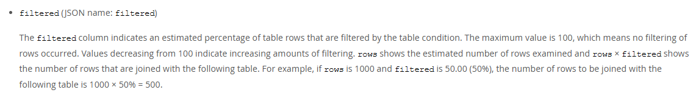

# 典型回答


在介绍执行计划的时候，我们重点介绍了key、type、extra等字段，没有展开介绍filtered这个字段。因为他其实不怎么重要。但是也有的面试官就爱问（太八股了，明明都不怎么关注，还要问。。。），到底filtered是越大越好还是越小越好？


### filtered的意义
**针对使用索引的查询来说，**`**filtered**`** 字段表示查询过程中通过索引扫描的行数中（其实就是执行计划中的rows字段），经过**`**WHERE**`** 条件过滤后，预计会保留下来的行的百分比（是个预估值）。这个值介于0.00-100.00之间。**


比如我们有一张表定义如下：


```plain
 CREATE TABLE `t2` (          
  `id` INT(11),
  `a` int(11) NOT NULL,                                                                                                                                                          
  `b` varchar(64) NOT NULL,                                                                                                                                                          
  `c` varchar(64) NOT NULL,                                                                                                                                                          
  `d` varchar(64) NOT NULL,                                                                                                                                                          
  `f` varchar(64) DEFAULT NULL,    
  PRIMARY KEY(id),                                                                                                                                                          
  KEY `idx_abc` (`a`)                                                                                                                                                       
) ENGINE=InnoDB DEFAULT CHARSET=latin1
```


那么，我们在使用条件where a > 32 and b = 'hollis' 查询的时候：

+ rows表示使用a这个索引扫描的行数。比如是10000
+ filtered表示使用b作为查询条件过滤后保留下来的数据的百分比。比如是10.00
+ 那么最终就会有10000*10% = 1000条数据被保留下来。


```plain
+-------------+-------+--------+---------+---------+----------+
| select_type | table | type   | key     | rows    | filtered |
+-------------+-------+--------+---------+---------+----------+
| PRIMARY     | t2    | ref    | idx_abc |  10000  |   10.00  | 
```


关于filtered是更大好，还是更小好这个问题，大家可以试着去问问AI，你会发现，众说纷纭。<u>（试着问问不同的AI，并多问几次，或者质疑他一下，你会发现，你彻底懵逼了。。。）</u>

<u></u>

其实，对于一个单表查询来说，这个filtered的值其实没什么意义。filtered很大，比如100，只能说明索引查询的结果都能用上，索引选的还不错。但是索引的性能咋样？不一定。


filtered很小，比如1.0，只能说明索引筛选后的数据中只有很小一部分能用上。同理也无法确定索引本身的效果如何，**但是如果数字filtered的很小，可能预示这个索引有优化的空间， 比如联合索引中加入更多的字段，让他可以在索引查询时就能过滤掉更多的数据。**


所以在分析索引效果的时候，我们基本都会忽略这个filtered字段的，更应该关注其他更重要的列（尤其是 `type`、`key` 和 `extra`）来优化查询。因为前面提过了，filtered其实已经是在索引使用之后其他where条件的事儿了。


### 和join的关系


而这个字段在一个特殊场景下有重要意义，那就是多表join的时候。


所以在mysql官网中，介绍filtered的时候（[https://dev.mysql.com/doc/refman/8.4/en/explain-output.html#explain_filtered](https://dev.mysql.com/doc/refman/8.4/en/explain-output.html#explain_filtered)），特意提了join的事儿：





翻译一下：filtered 列表示通过表条件过滤后的表行数的估计百分比。最大值为 100，这意味着没有发生行过滤。该值从 100 开始递减表示过滤量增加。rows 显示检查的估计行数，而 rows × filtered 表示要与下一个表连接的行数。例如，如果 rows 为 1000，filtered 为 50.00（50%），则要连接到下一个表的行数为 1000 × 50% = 500。


