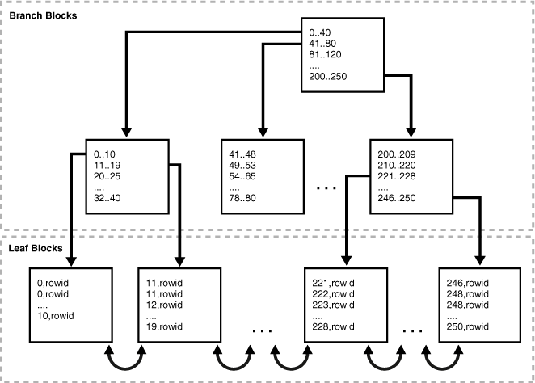
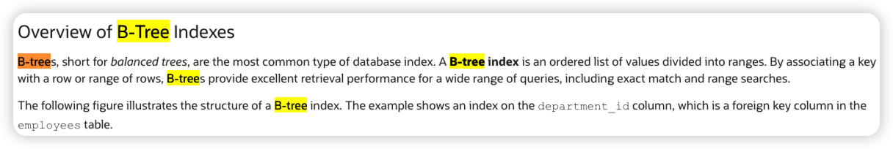

# 典型回答

:::danger
先问是不是，再问为什么！！！

Oracle的索引是B-树索引吗？（ps：B-树索引是通过B-tree翻译过来的，不要读成"B减树"，直接读成"B树"才对）

不是！

那Oracle是什么索引？

其实是B+树！

那为什么很多人说是B-树？

因为Oracle官方也是这么说的。

:::

然后继续一点一点讲。先搞清楚B树和B+树有啥区别。

[✅什么是B+树，和B树有什么区别？](docs/数据结构/✅什么是B+树，和B树有什么区别？.md)

主要有以下2个区别：

1. _**数据存储位置：在B树中，数据项存储在叶子节点和非叶子节点上，而在B+树中，数据项只存储在叶子节点上。非叶子节点只包含键值信息。**_
2. _**叶子节点指针：B树的叶子节点之间没有指针连接，每个叶子节点独立存储数据项。而B+树的叶子节点通过指针连接成一个链表，可以方便地进行范围查询。**_

那么，接着看，Oracle的索引到底长啥样。

以下是Oracle官方给出的他的索引的结构，原文链接我也贴在下面了。

[https://docs.oracle.com/en/database/oracle/oracle-database/23/cncpt/indexes-and-index-organized-tables.html#GUID-FC93A85B-C237-4249-AD1E-FF54576ED050](https://docs.oracle.com/en/database/oracle/oracle-database/23/cncpt/indexes-and-index-organized-tables.html#GUID-FC93A85B-C237-4249-AD1E-FF54576ED050)

可以看到，他的非叶子节点上，只有索引的值（和指针），而在叶子结点上有索引值和rowid。符合B+树只有叶子结点存储数据的特点。

其次，叶子结点之间是有双向指针链接的，这也是B+树的特征。

所以，**这就是一棵B+树。**

****

为啥广为传播的说Oracle使用的是B树呢？因为他官网自己说的：

那他说错了么？

其实也没错，因为"B-tree" 常常被用作一个广义的术语，涵盖了B树及其变体（如B+树）。所以在Oracle早期文档中就是这么叫的，所以这种命名方式也一直延续下来了。

