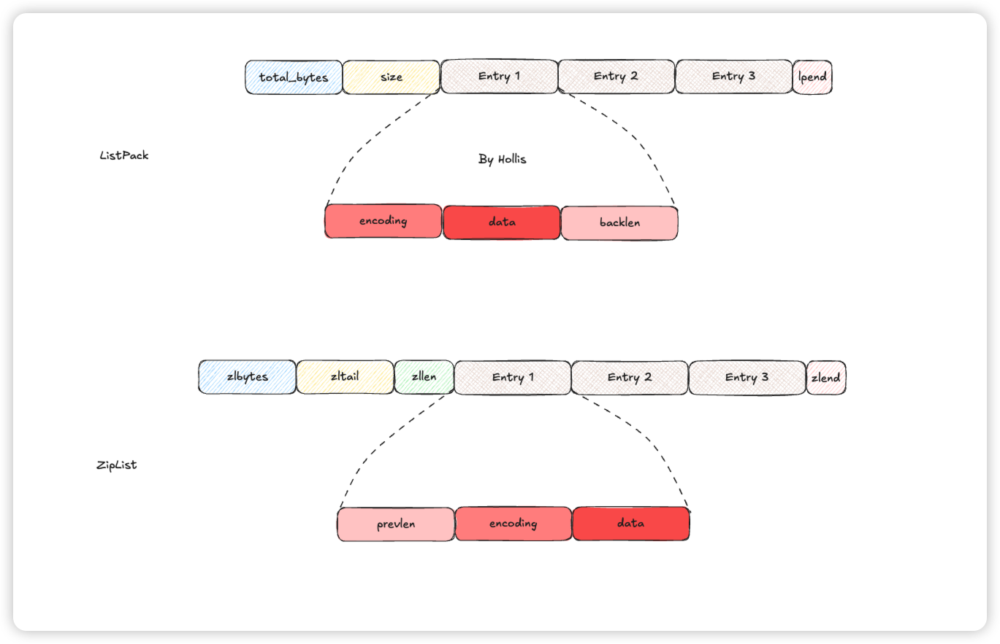

# 典型回答

[✅介绍下Redis中的ZipList和他的级联更新问题](docs/Redis/✅介绍下Redis中的ZipList和他的级联更新问题.md)

上面的文章中，介绍过ZipList的级联更新问题。为了解决这个问题，Redis在5.0中推出了一个新的数据结构，那就是我们要介绍的ListPack了。

我们知道，ZipList之所以会出现级联更新，主要是因为他的Entry中有个prevlen字段，记录的是上一个Entry的长度，并且在长度不同的情况下可能会用1个或者5个字节表示。

那么ListPack为了解决这个问题，其实只要把prevlen干掉就行了，他也正是这么干的， 看下ListPack的结构：

主要改动是Entry这里，废弃了原来的prevlen，而是改用了新的方式，用一个backlen来记录整个Entry的字节数。并且位于元素末尾。他同样采用变成存储，可以用1-5个字节来存储。

就这样，因为ListPack的每个数据项都只会记录自己的长度，而不是再记录上一个节点的长度了，那么，在ListPack中新增或者删除元素，只会影响到这个元素自己，而不需要其他的元素进行级联更新了。也就解决了级联更新的问题了。

