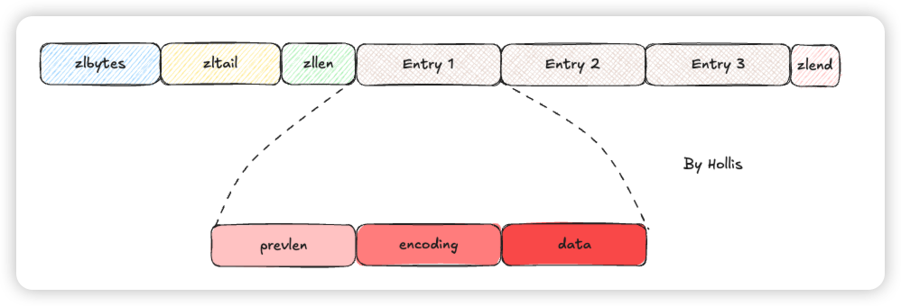
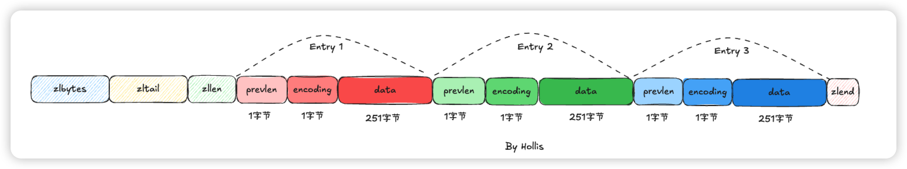
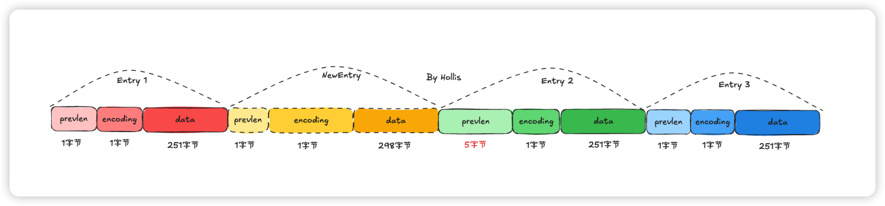

# 典型回答

ZipList是Redis中的一个数据结构，用来实现ZSet，他是一个压缩的数据结构，它的每个元素都是连续存储的，因此内存的使用非常紧凑。

以上是ZipList的结构。其中包含了：

+ **zlbytes**：4字节，整个 ziplist 的字节数
+ **zltail**：4字节，最后一个 entry 的偏移量
+ **zllen**：2字节，entry 的数量
+ **Entry**：实际存储的数据项
+ **zlend**：1字节，结束标记

其中的Entry就是存储的数据项，他的结构是：

+ **prevlen**：存储**前一个 entry 的长度**
    - 前一个 entry 长度 < 254：1 字节
    - 前一个 entry 长度 ≥ 254：5 字节（首字节固定 0xFE）
+ **encoding**：内容编码（类型 + 长度）
+ **content**：实际数据

这里需要注意的是，prevlen的长度不是固定的，如果前一个Entry的长度字节数小于254，则占用1个字节，而如果大于等于254，则占用5个字节。

### ZipList的级联更新问题

假设现在ZipList中存了3个Entry，他们的总长度都是253字节。

这时候在Entry1之后插入一个新结点，比如它的长度是300字节。这时候会发生什么？

首先Entry2中的prevlen是需要改的，因为Entry2的前一个节点已经不是Entry1了，而是我们插入的NewEntry。

因为NewEntry的总长度超过了254，所以他后面的Entry的prevlen就要用5个字节了，即：

但是事情还没完，Entry 2的长度变了，是可能会影响到他后面的Entry 3的，因为Entry 2再增加了4个字节之后（5-1等于4），他的总长度也超过了254，那么Entry 3也要跟着变。。。。

那么如果Entry 3后面还有Entry 4呢，后面还有Entry 5 、Entry 6 。。。。。Entry 100呢，最糟的情况就是大家都要跟着变。可想而知这过程是非常耗费性能的！！！

这就是所谓的**级联更新**。

