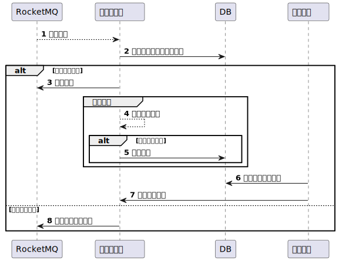

# 典型回答

RocketMQ的消息堆积（包括所有其他的MQ），一般都是因为客户端本地消费过程中，由于消费耗时过长或消费并发度较小等原因，导致客户端消费能力不足，出现消息堆积的问题。

**首先，需要明确的是，MQ堆积是正常的，因为MQ有个重要的作用就是削峰填谷，既然他能起到削峰填谷的作用，那就意味着他需要帮你去接收更多的消息，然后放到自己的队列里面，下游再慢慢消费。所以，出现堆积的情况不要慌，也不一定要立刻就进去解决。**

所以，MQ堆积的这个问题一旦发生了，比如线上有告警了，处理过程应该是：

1、先去定位具体什么场景，哪个topic的消息堆积了

2、看下当前的堆积情况是否严重，是否在减缓

3、查看上游流量情况，是否有营销活动，或者定时任务在运行

4、分析下堆积导致的延迟是否可以接受

5、考虑扩容增加消费者提升消费速度

6、优化代码，进一步解决堆积的问题

### 定位问题

MQ堆积了，我们是经常出现的，经常会出现几十万条的堆积告警，一般看到这个告警提示堆积的时候，会先看下是哪个topic堆积了，具体是什么业务在消费这个消息。

同时报警提示有10万条堆积，但是当前还有多少， 是比10万更多了，还是慢慢的在消费掉了，比如还剩3万了。这个需要看一下，有可能有突发流量过了。然后很快消费掉了是常见的事儿。

然后，你需要再去看下这个消息是谁发的，直接看下他们的流量或者直接招人问一下，是不是有什么营销活动导致流量激增，是不是在跑什么定时任务导致集中发消息了。

通过以上定位之后，基本上就可以判断这个“问题”到底需不需要解决了，很多时候可以不用解决，比如：

1、消息虽然堆积了一下，但是很快就都消费掉了。

2、这个场景消息堆积造成的影响不大，比如业务本身就能接受一定延迟，晚一点也无所谓，慢慢消费就行了。

3、上游在跑定时任务，一次性的，很快就跑完了，消息慢慢消费也可以。

> 关于延迟，其实用了MQ本身就是可以接受延迟的，只是这个延迟的大小的阈值不同而已，所以根据实际业务的情况判断下是否可以接受，很多MQ的消费，其实小时级的延迟都是问题不大的。当然也有一些要分钟级处理，这种就需要介入看了。
>

### 解决问题

如果定位到MQ堆积之后，经过分析发现这个问题还是需要解决的话，那么就有2种方案，一种是临时方案，一种是长期方案。

先说临时方案，快速解决堆积的问题，首先就是考虑扩容，增加消费者的数量，因为消息堆积了，消费不过来了，那就把消费者的数量增加一下，让更多人的实例来消费这些消息。（但是扩容的时候，需要考虑下游服务的承载能力，不要把下游给打挂了。）

长期方案那就是改代码了，但是面试的时候，也不能上来就八股吟唱，还是要先分析问题在哪。

消息堆积，有效方式就是提升消费速度，消费速度慢可能有很多原因，比如：

1、消息投递速度慢

2、出现了慢SQL

3、单线程存在瓶颈

4、下游服务RT变长

5、整个MQ消费的处理流程长

如果是**消息的投递速度慢**的话，可能是MQ用的不对，使用了单条拉消息的方案，其实RocketMQ是支持批量拉消息的，可以考虑换成批量拉消息的方案，通过调整ConsumeMessageBatchMaxSize的值来拉取批量消息，默认32条一次，可以调整到更高。还可以调整BatchConsumeMaxAwaitDurationInSeconds来设置批量消费的最大等待时长。

针对**慢SQL**的情况，有的时候线上跑的好好地，一直都没有慢SQL，但是突然有一天就有了慢SQL了，大部分原因是因为数据量积累变多了，导致表变大了，CRUD都变慢了。这时候就需要从数据库层面优化了，比如做数据归档、分库分表、增加索引等方式，提升SQL速度。

**单线程存在瓶颈**，这种也比较常见，那比较典型的方案就是引入线程池来进行并发消费，让多线程一起来干活。这种要配合批量消息来做，并且需要考虑如果有某个线程失败了，导致消息丢失的问题。（这个在我的[项目课]()中有具体的落地代码和解决方案）

**下游RT变长**，这种一般是在MQ消费过程中需要调外部服务，而外部服务的RT比较长导致的， 这种一方面是让下游做优化，提升他的RT。要不然就可以和下一个问题解决方案一样。

最后一个就是**整个MQ消费的处理流程长**，可能是因为SQL慢但是又不好治理，或者前面说的下游RT长，或者就是要干的事情多，这种情况，可以采用一种方案 ，那就是先收单，然后再通过定时任务慢慢处理的方式。执行流程如下：

相当于让消息不要在MQ中堆积，而是自己收单存在来，放到自己的数据库中，靠定时任务消费处理，好处是可以避免消息投递多次不成功之后被删除。

除了以上方案，还有其他的方案，比如：

1. 降低生产者的生产速度：如果生产者可控的话，可以让生产者生成消息的速度慢一点。
2. 清理过期消息：有一些过期消息、或者一直无法成功的消息，在业务做评估之后，如果无影响或者影响不大，其实是可以清理的。

[✅RocketMQ消费堆积问题排查](docs/线上问题排查/✅RocketMQ消费堆积问题排查.md)

