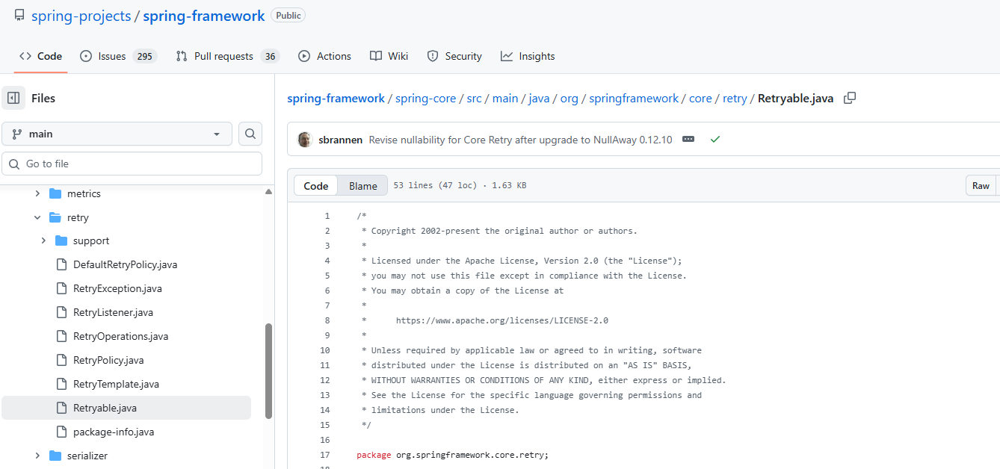

# <font style="color:rgb(17, 17, 51);">典型回答</font>


2025 年 11 月，Spring Framework 7.0 和 Spring Boot 4.0 已正式发布。新特性挑一些比较重要的介绍下。

<font style="color:rgb(17, 17, 51);"></font>

### <font style="color:rgb(17, 17, 51);">最低版本要求</font>


这个版本同样对一些基础依赖的版本提出了要求，JDK要求最低要17，推荐用JDK 21 （支持虚拟线程），也可以直接用当前的最新的LTS版本——JDK 25（截止2025年11月）。


Jakarta EE全面替代java ee，javax包废弃，并且Jakarta EE升级到11了。另外构建工具要求Maven 3.6.3+ / Gradle 8.5+（Spring Boot 4 还支持 Gradle 9）


### `**<font style="color:rgb(17, 17, 51);background-color:rgba(175, 184, 193, 0.2);">RestTemplate</font>**`**<font style="color:rgb(17, 17, 51);"> 弃用</font>**


`RestTemplate` 正式弃用（7.1 标记为 `@Deprecated`，8.0 移除）推荐使用`RestClient`（非响应式）和`WebClient`（响应式）


另外，Feign也有替代产品了——声明式 HTTP 客户端（@HttpExchange），这个其实在Spring Boot 3中就有了，在这个版本做了更新，更是官方强烈推荐使用了

<font style="color:rgb(17, 17, 51);"></font>

```plain
@HttpExchange("/users")
interface UserClient {
    @Get("/{id}")
    User findById(String id);
}
```


### Jackson 3 全面集成


默认 JSON 处理库升级为 Jackson 3.x包名从 `com.fasterxml.jackson`改为`tools.jackson`，目前仍可并行使用 Jackson 2 和 3，但 Jackson 2 将在 Spring 7.2 中移除。

<font style="color:rgb(17, 17, 51);"></font>

### <font style="color:rgb(17, 17, 51);">JSpecify</font>


<font style="color:rgb(17, 17, 51);">Spring 框架代码库全面采用 </font>**<font style="color:rgb(17, 17, 51);">JSpecify </font>**<font style="color:rgb(17, 17, 51);">的 </font>`<font style="color:rgb(17, 17, 51);background-color:rgba(175, 184, 193, 0.2);">@Nullable</font>`<font style="color:rgb(17, 17, 51);"> / </font>`<font style="color:rgb(17, 17, 51);background-color:rgba(175, 184, 193, 0.2);">@NonNull</font>`<font style="color:rgb(17, 17, 51);"> 注解。支持泛型、数组、可变参数的精确空值语义。</font>

<font style="color:rgb(17, 17, 51);"></font>

> JSpecify 是 Java 社区近年来在空安全（null safety） 领域推动的一项重要标准，旨在为 Java 提供一种统一、可互操作、工具友好的空值注解规范。(由 Google、JetBrains、Oracle、Red Hat、VMware 等多家公司联合发起的 开源项目与规范)
>


<font style="color:rgb(17, 17, 51);">在 JSpecify 出现前，Java 社区已有多种空值注解：</font>

+ `<font style="color:rgb(17, 17, 51);background-color:rgba(175, 184, 193, 0.2);">javax.annotation.Nullable</font>`<font style="color:rgb(17, 17, 51);">（JSR-305，已停滞）</font>
+ `<font style="color:rgb(17, 17, 51);background-color:rgba(175, 184, 193, 0.2);">org.jetbrains.annotations.Nullable</font>`
+ `<font style="color:rgb(17, 17, 51);background-color:rgba(175, 184, 193, 0.2);">edu.umd.cs.findbugs.annotations.Nullable</font>`
+ `<font style="color:rgb(17, 17, 51);background-color:rgba(175, 184, 193, 0.2);">androidx.annotation.Nullable</font>`
+ `<font style="color:rgb(17, 17, 51);background-color:rgba(175, 184, 193, 0.2);">lombok.NonNull</font>`
+ <font style="color:rgb(17, 17, 51);">Spring 自己的 </font>`<font style="color:rgb(17, 17, 51);background-color:rgba(175, 184, 193, 0.2);">@Nullable</font>`


但是存在着工具不兼容（IDEA 认 JetBrains，SpotBugs 认 FindBugs）、语义模糊（有些表示“运行时检查”，有些表示“静态分析”）、无法跨库协作等问题，而Specify提供了同意的解决方案，内置@Nullable 和 @NotNull 两个注解。在Spring 7中，所有公共方法、参数、返回值、字段均使用 `@Nullable` / `@NonNull` 标注。

<font style="color:rgb(17, 17, 51);"></font>

### <font style="color:rgb(17, 17, 51);">内置韧性能力</font>


Spring Framework 7（以及 Spring Boot 4）在内置韧性（Resilience）能力方面迈出了一大步，将原本需要依赖第三方库（如 Resilience4j、Spring Retry）的常见容错机制直接集成到核心框架中，实现“开箱即用”的弹性编程模型。


主要内置了两大能力，重试和并发限制（限流）。


在之前，其实也有@Retryable注解，他提供的就是重试的能力，但是之前需要单独依赖spring-retry的包，在Spring 7中，这个注解变成内置的了，不用再单独依赖外部的包了。





同时，Spring 7中引入了一个并发限制的注解`<font style="color:rgb(17, 17, 51);background-color:rgba(175, 184, 193, 0.2);">@ConcurrencyLimit</font>`

<font style="color:rgb(17, 17, 51);background-color:rgba(175, 184, 193, 0.2);"></font>

```plain
import org.springframework.resilience.annotation.ConcurrencyLimit;
import org.springframework.stereotype.Service;

@Service
public class InventoryService {

    // 限制该方法最多同时处理 50 个请求
    @ConcurrencyLimit(maxConcurrentCalls = 50)
    public boolean checkStock(String sku) {
        return warehouseApi.check(sku);
    }

    // 更高级：动态限流（基于运行时指标）
    @ConcurrencyLimit(
        maxConcurrentCalls = 100,
        strategy = ConcurrencyLimitStrategy.ADAPTIVE // 自适应算法
    )
    public void updateOrderStatus(Order order) {
        db.update(order);
    }
}
```


支持固定上限或自适应算法（根据延迟、错误率动态调整）。


### 虚拟线程支持


在Spring Boot 4中，针对虚拟线程有了进一步的支持，可以更加方便的使用虚拟线程，在spring boot中增加以下配置：


```plain
spring:
  threads:
    virtual:
      enabled: true
```


就能开启虚拟线程，这样我们使用的@Async 注解就默认使用虚拟线程了，可以让整体的吞吐量提升5-6倍，CPU使用率也能下降40%。


### API版本控制


Spring Boot 4.0版本中RequestMapping引入了version进行版本控制，可以优雅管理多版本API：


```plain
@RestController
@RequestMapping("/api/user")
public class UserController {
    
    @GetMapping(version = "1")
    public UserV1 getUser() {  }
    
    @GetMapping(version = "2")
    public UserV2 getUserV2() {  }
}
```


可以在请求参数中增加`version=1`的方式来路由到版本1的方法中。


### GraalVM原生镜像深度集成


Spring Boot 4.0将GraalVM原生编译从实验特性升级为正式生产级支持，通过AOT（Ahead-of-Time）编译实现启动时间与内存占用的优化：


+ 启动效率：传统JVM模式下500ms启动的微服务，编译为原生镜像后降至50ms以内，适用于Serverless等云原生场景
+ 内存占用：典型微服务堆内存从2GB缩减至120MB级别，资源成本降低80%以上

