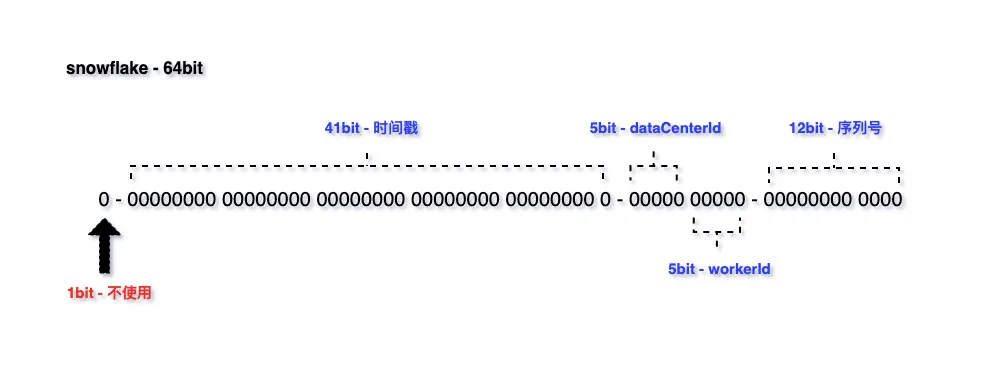

# 典型回答


[✅什么是雪花算法，怎么保证不重复的？](docs/分布式/✅什么是雪花算法，怎么保证不重复的？.md)


上面介绍过雪花算法，他可以旨在生成一个64位的、全局唯一、趋势递增的Long类型ID。雪花算法生成的ID由以下几个部分组成：

1. 符号位（1bit）：预留的符号位，始终为0，占用1位。
2. 时间戳（41bit）：精确到毫秒级别，41位的时间戳可以容纳的毫秒数是2的41次幂，一年所使用的毫秒数是：365 * 24 * 60 * 60 * 1000，算下来可以使用69年。
3. 数据中心标识（5bit）：可以用来区分不同的数据中心。
4. 机器标识（5bit）：可以用来区分不同的机器。
5. 序列号（12bit)：可以生成4096个不同的序列号。





所谓时钟回拨，是指生成分布式ID的服务器上的系统时间，由于某种原因，突然相比之前的时间发生倒退了。**产生始终回拨的主要原因通常包括**：

1. **网络时间协议（NTP）同步**：这是最常见的原因。操作系统会自动与NTP服务器同步时间，如果本地时间快了，NTP会强制将时间回调。
2. **人工手动修改**：运维人员误操作，手动将系统时间改错了。
3. **闰秒调整**：极少数情况下，操作系统处理闰秒时可能采用“倒退一秒”的策略。


**而当前时间的时间戳作为雪花算法中重要的一部分，一旦时间戳倒退了，那么就意味着单台机器上生成的ID可能会出现不顺序递增的情况，当然， 更加严重的就是发生重复。**

****

（因为对于同一台机器来说，数据中心标识、机器标识可能都是一样的，而如果时间戳又出现了相同的情况，那么一旦序列化也一致了，那么就会出现重复ID，所以时钟回拨会导致重复的概率大大升高。）


### 解决方案


解决时钟问题，有几种典型的方案：

1、等待法

2、动态切换机器标识或者数据中心标识

3、直接抛异常

4、提前生成一批ID备用


### 等待法


如果回拨时间非常短（比如几百毫秒左右），我们可以选择等待一小段时间，让系统时间追上来。实现方式就是让当前线程sleep一下，然后再执行。


```plain
if (currentTimestamp < lastTimestamp) {
    long offset = lastTimestamp - currentTimestamp;
    Thread.sleep(offset); // 等待offset毫秒
}
```


### 切换法


如果发生时钟回拨，这时候我们可以通过动态切换一下机器标识或者数据中心标识等方式，来避免生成的ID重复。


因为机器ID有5个bit，那么我们就可以提前预留一个bit，当出现回拨时，就把这个一个bit运用上，这样机器ID变了，即使其他的都相同，那么整个生成的结果也就不一样了。


### 抛异常


这种看似不像方案的方案其实用的也挺多的，比如美团的leaf，百度的UidGenerator也都采用过。


因为时钟回拨并不常见，而且就算发生了，也不代表着生成的ID一定就会重复。所以重复其实是个低概率事件，而且，就算时钟不回拨，雪花算法也有极端情况下会重复（并发极高，在同一台机器，时间戳相同，序列号也刚好相同的情况），所以，遇到重复的情况，直接阻断流程也是一种方案，这样至少能避免数据重复。


> <font style="color:rgb(15, 17, 21);">美团的 </font>`<font style="color:rgb(15, 17, 21);background-color:rgb(235, 238, 242);">Leaf</font>`<font style="color:rgb(15, 17, 21);">方案使用ZooKeeper持久化存储工作节点ID和上次的时间戳。启动时检查时钟回拨，如果回拨时间过长（超过阈值），则启动失败，等待人工处理。</font>
>


### 提前生成一批ID备用


在上面的方案的基础上，如果时钟回拨的时间比较长的话，也可以考虑提升生成一批ID，存在Redis里面，一旦出现时钟回拨了，那么就可以去Redis中取出之前生成好的ID来用。


这样至少可以避免重复，但是会导致单机生成的ID不会是顺序递增得了。但是其实影响也不算很大。


