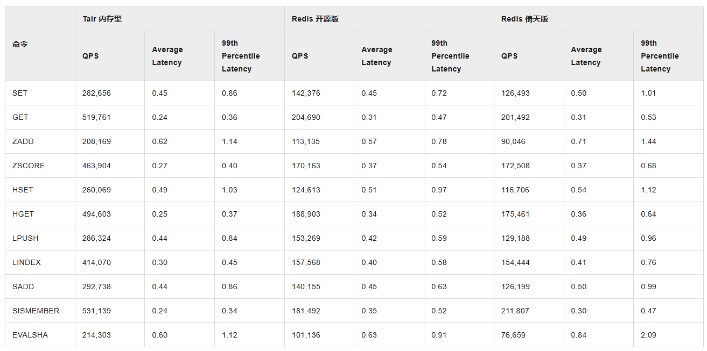

# 典型回答


Redis是基于内存的，MySQL是基于磁盘的（非Memory引擎），所以Redis要比MySQL快，一次RT要分两部分，一部分是网络交互的耗时，一部分是命令（SQL）执行的耗时。但是不管怎么说，Redis都要比MySQL快得多。


先说下纯命令（SQL）执行耗时情况。

### **<font style="color:rgb(64, 64, 64);">Redis命令执行耗时</font>**
<font style="color:rgb(64, 64, 64);">Redis的简单命令（如</font>`<font style="color:rgb(64, 64, 64);background-color:rgb(236, 236, 236);">GET</font>`<font style="color:rgb(64, 64, 64);">、</font>`<font style="color:rgb(64, 64, 64);background-color:rgb(236, 236, 236);">SET</font>`<font style="color:rgb(64, 64, 64);">）执行耗时大概在</font>**<font style="color:rgb(64, 64, 64);">0.1ms~1ms</font>**<font style="color:rgb(64, 64, 64);">（100-1000微秒）。</font><font style="color:rgb(64, 64, 64);">复杂命令（如</font>`**<font style="color:rgb(64, 64, 64);background-color:rgb(236, 236, 236);">ZADD</font>**`<font style="color:rgb(64, 64, 64);">、</font>`**<font style="color:rgb(64, 64, 64);background-color:rgb(236, 236, 236);">HSET</font>**`<font style="color:rgb(64, 64, 64);">）的执行耗时大概在</font>**<font style="color:rgb(64, 64, 64);">1ms~5ms</font>**<font style="color:rgb(64, 64, 64);">左右。</font>

<font style="color:rgb(64, 64, 64);"></font>

下图是阿里云给出的Redis和云上服务的对比图，可以看到，Redis的P99基本都在1毫秒以内的。（测试环境：标准架构（双副本），不启用集群， 8 GB）




测评地址：[https://help.aliyun.com/zh/redis/support/performance-whitepaper-of-community-edition-instances](https://help.aliyun.com/zh/redis/support/performance-whitepaper-of-community-edition-instances)


### **<font style="color:rgb(64, 64, 64);"> MySQL的SQL运行耗时</font>**


首先，对于MySQL来说，命中索引、命中buffer pool，无join等等都对性能有很大的影响。但是还是能给出一些大致的范围的。


如果一个查询，直接命中buffer pool并且通过主键查询，那么可能在2ms以内也能返回。比Redis慢不了多少。


如果没有命中buffer pool，就需要去磁盘读取，这时候就需要更多的耗时了，一般我们认为一次查询如果超过1秒钟算是慢SQL了，所以，**一个正常的查询语句，应该在1000ms内返回，我们普遍认为200ms-500ms以内算是比较好的一个性能了。**


以上说的不包括任何的网络交互的时长，还要再加上网络耗时，那么网络耗时怎么算的呢？


### 网络耗时


一次HTTP交互过程包括DNS解析、TCP握手、LS握手、HTTP请求、HTTP响应几个步骤了。那么一次请求（非HTTP 3.0的情况）就是：


```plain
DNS解析（5ms~300ms）  
  → TCP握手（1.5×RTT）  
  → TLS握手（1×RTT）  
  → HTTP请求/响应（1×RTT）  
总耗时 = DNS + 3.5×RTT  
```

大概3.5个RTT加上DNS解析的耗时了。


[✅HTTP/2存在什么问题，为什么需要HTTP/3？](#DIAVV)


RTT是什么呢？就是一次请求的往返时间，那么这个又咋算呢，可以给个大概的参考：


### **<font style="color:rgb(64, 64, 64);">二、典型场景下的网络耗时</font>**
#### **<font style="color:rgb(64, 64, 64);">1. 局域网（LAN）</font>**
| **<font style="color:rgb(64, 64, 64);">场景</font>** | **<font style="color:rgb(64, 64, 64);">平均RTT</font>** |
| --- | --- |
| <font style="color:rgb(64, 64, 64);">千兆以太网（同交换机）</font> | <font style="color:rgb(64, 64, 64);">0.1ms~0.5ms</font> |
| <font style="color:rgb(64, 64, 64);">WiFi 6（近距离）</font> | <font style="color:rgb(64, 64, 64);">1ms~5ms</font> |
| <font style="color:rgb(64, 64, 64);">企业内网跨机房</font> | <font style="color:rgb(64, 64, 64);">1ms~2ms</font> |


#### **<font style="color:rgb(64, 64, 64);">2. 广域网（WAN）</font>**
| **<font style="color:rgb(64, 64, 64);">场景</font>** | **<font style="color:rgb(64, 64, 64);">平均RTT</font>** |
| --- | --- |
| <font style="color:rgb(64, 64, 64);">同城数据中心（≤100km）</font> | <font style="color:rgb(64, 64, 64);">1ms~5ms</font> |
| <font style="color:rgb(64, 64, 64);">跨省（如北京→上海）</font> | <font style="color:rgb(64, 64, 64);">20ms~30ms</font> |
| <font style="color:rgb(64, 64, 64);">跨国（如中国→美西）</font> | <font style="color:rgb(64, 64, 64);">100ms~150ms</font> |
| <font style="color:rgb(64, 64, 64);">卫星通信（如Starlink）</font> | <font style="color:rgb(64, 64, 64);">20ms~50ms</font> |


#### **<font style="color:rgb(64, 64, 64);">3. 移动网络</font>**
| **<font style="color:rgb(64, 64, 64);">场景</font>** | **<font style="color:rgb(64, 64, 64);">平均RTT</font>** |
| --- | --- |
| <font style="color:rgb(64, 64, 64);">4G LTE</font> | <font style="color:rgb(64, 64, 64);">30ms~100ms</font> |
| <font style="color:rgb(64, 64, 64);">5G SA（Sub-6GHz）</font> | <font style="color:rgb(64, 64, 64);">10ms~30ms</font> |
| <font style="color:rgb(64, 64, 64);">5G毫米波（mmWave）</font> | <font style="color:rgb(64, 64, 64);">1ms~10ms</font> |


  
 


