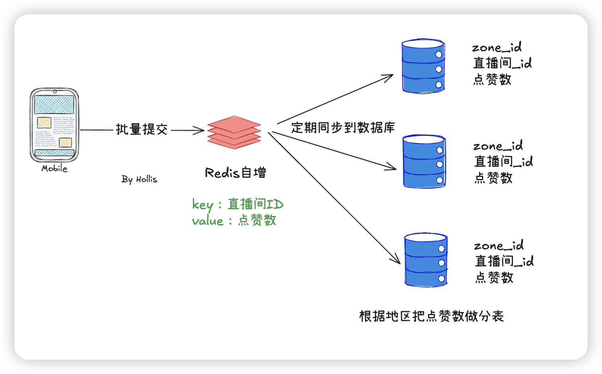

# 典型回答


关于点赞的方案设计，我看最近讨论的还挺多的。很多人认为点赞不需要用Redis，直接数据库干就行了。这么说对不对呢？我们分析下点赞的难点在哪？


**对于点赞来说，最大的难点可能就是高并发情况下如何确保点赞数量的准确性了。**


那么也就是说，如果你没有高并发场景（大部分点赞业务都没有），或者你不在乎准确性（大部分点赞也不在乎），那么就没任何难度。


既然没难度，那就**最简单的实现方式，在数据库做累加就行了**。一条SQL搞定：


```plain
update table set like = like + 1 where id  = xxx;
```


但是，**如果涉及到高并发，比如说视频直播间的点赞，就会有高并发的情况**，还记得黄子韬直播间点赞数变成负数的事么，既然都能超过int的最大值，那么说明点赞的并发一定不低的。


**高并发情况下的点赞，其实就是个热点更新问题了。**因为你要对同一个记录，即同一个直播间的点赞数做累加。最大的问题就是如果只靠数据库的update的话，这就和秒杀的商品库存扣减是一回事儿了。


如果要用数据库去扣减的话，可以考虑拆分、合并、以及hint的方式。详见下面这几个。


[✅高并发的库存系统，在数据库扣减库存，怎么实现？](docs/场景题/✅高并发的库存系统，在数据库扣减库存，怎么实现？.md)


[✅阿里的库存秒杀是如何实现的？](docs/大厂实践/✅阿里的库存秒杀是如何实现的？.md)


但是实际上，在点赞这个业务中，我们就拿**直播间点赞来说，他比较适合的其实是合并的这个方案**。因为直播间点赞的典型场景就是一个用户会在直播间不断的点赞，但是其实我们不需要每一次用户点赞都传递到后端去做点赞的累加。只需要前端做个批次，一次性把用户一段时间内的总点赞数传递到后端去，后端再去更新到数据库中就行了，这其实就可以大大的降低并发。


还有就是Redis到底能不能用，我认为**点赞场景用redis肯定是可以的，但是要看有没有必要**，如果是高并发， 并且对性能也有比较高的要求，是可以先在Redis中保存一下点赞数，利用Redis的高并发特性做累加，然后再定期的把点赞结果同步到数据库中的。


这里面带来的缓存和数据库的一致性问题，以及redis挂了数据丢了怎么办的问题，其实在点赞这个场景中，对一致性要求并不高，你说一个直播间，到底是点赞10086次，还是11111次，其实只要量级上差别不大即可，他并不是一个对一致性要求极高的场景。


以下就是个最完善的点赞场景的数据更新方案，结合了批量提交、Redis存储以及数据库拆分的方案。





查询的时候，先去Redis查询直接返回即可，如果Redis中没有数据（一般不会，除非是Redis挂了之后换了节点之类的），再去数据库中查询，但是因为数据库中做了拆分，所以要把同一个直播间在不同的地区中的点赞数做个汇总，把结果返回给前端并保存在Redis中。


