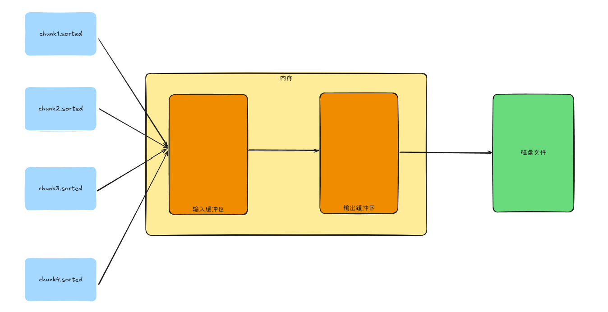
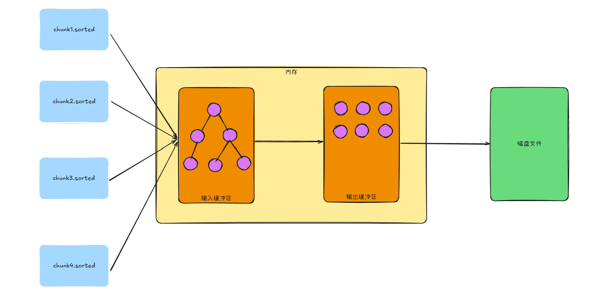

# 典型回答

这是一个典型的海量数据处理的问题，1T数据排序，但是内存只有32G，那么就意味着，不可能一次性加载到内存中进行排序了。

解决这个问题，最常见的一种方案就是——**外部归并排序，外部归并排序主要是把一个大的排序过程拆分成分块排序和多路归并两个步骤。**

### 分块排序
+ 将 1TB 数据**分成多个小块**
    - 如果32G内存全都干满，刚好32*32 = 1024，但是实际上每个块不太可能把32G内存全部都用上，需要预留一部分给操作系统用，还要有些内存用来做排序操作。
    - 所以，我们假设每个块需要30G左右内存吧，那么大概需要分成35个块，我们干脆直接取一个2的倍数，分成36块。
+ 逐块读取到内存中，在内存中**对每个小块进行高效排序**（如快排、归并、Timsort）。
+ 将每块排序结果**写回磁盘**，**生成多个有序的临时文件**（如`chunk1.sorted`, `chunk2.sorted`等）。

按照以上操作技术后，我们就得到了36个有序的文件，但是这个有序是局部有序（单文件内）的，我们还需要做全局排序。

但是做这个全局排序的时候，还是没办法都加载在内存中的，那么比较简单的的方案就是同时读取多个块（文件），每次取最小的元素。

### 多路归并

如果，我们针对36个文件进行排序的话，我们的内存需要分成两个职责，分别是输入缓冲区和输出缓冲区。

+ **输出缓冲区**：预留一部分内存用于缓存合并后的结果。
+ **输入缓冲区**：内存中均分给每个块的输入缓冲区。

假设我们给输入缓冲区和输出缓冲区都留1G的话，那么明显32G是无法同时读取36个文件的，因为这样的话需要至少36*1G + 1G = 37G内存。

这时候，我们就需要分批进行了。这就是所谓的**多路归并**。比如刚刚说的36个文件同时读取就是36路归并。

这里的多路到底怎么选呢？上面提到了要受内存限制的影响，还有就是要考虑磁盘IO的情况，因为如果给缓冲区留的内存越多的话，那么磁盘读取的次数就会更小。而缓冲区内存更大，意味着分路要更少。而路数更少，意味着归并的次数要越多。（一次干36个，和一次干2个，肯定后面的活干的次数多）

所以，综合以上考量，我们可以考虑做8-18分路。假设我们取其中的可以被36整除的9吧。

+ 打开9个有序块（临时文件），为每个块分配文件句柄，**并预读初始数据到输入缓冲区。**
+ 从每个块的输入缓冲区中取第一个元素，与块索引（就是来自哪个文件）一起插入最小堆。
+ 弹出堆顶元素（当前最小），**写入输出缓冲区**。记录该元素来源的块索引（假设来自块 i）。
+ 从块 i的输入缓冲区中**取下一个元素**。
    - 若块 i 的缓冲区已空，从磁盘读取下一批数据到缓冲区，若块 i 的数据已全部读完，则关闭该块。
    - 若块 i 仍有数据，将缓冲区的新元素插入堆中。若堆为空，归并结束。
+ 当输出缓冲区满，将**其写入最终结果文件，并清空缓冲区。**

以上操作之后，9个文件就会被合并成一个文件，比如叫`chunk_merge1.sorted`，然后继续读取另外9个文件，这样分四次，就合并成了4个有序文件了。

然后就继续按照上面的顺序，读取这四个文件，进行排序即可，最终就可以输出为一个文件了。

