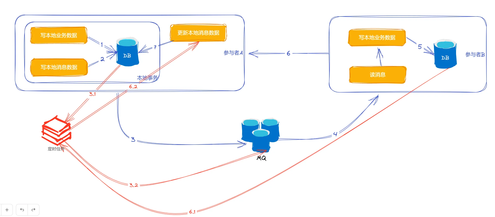

# 典型回答

**<u>首先，我们需要知道，本地消息表的方案并不适合用在这种需要回滚的场景，而是适合用在哪种不需要回滚的场景。什么场景不需要回滚呢？</u>**

**<u></u>**

**<u>举个例子，我们都知道，用户下单之后，会给用户创建一个运费险，那么这个场景，一般运费险的投保过程前置条件就是下单成功，而且，下单的时候给用户表达了有运费险，那么就意味着，一旦下单成功了，就必须要投保成功。不能因为投保未成功而导致订单回滚。</u>**

**<u></u>**

**<u>所以，这就是典型的本地消息表的，或者是事务消息适合的场景！！！即不回滚，必须成功。</u>**

但是，如果面试官问了这个问题，你回答了上面的内容，他还是问你，我就要回滚，该咋做呢？

[✅如何基于本地消息表实现分布式事务？](docs/分布式/✅如何基于本地消息表实现分布式事务？.md)

这是我们讲过的本地消息表的方案，我们都知道，这种引入MQ的机制，就意味着整个过程不可能做成一种自动回滚的机制了，因为MQ就代表着两个系统已经解耦了，互相没关系了。

首先，下游服务处理消息时发生业务失败，如网络异常、数据校验不通过、依赖服务不可用等等，需要先明确返回一个失败的响应，这样MQ就会继续投递这个消息。所以，失败的时候，我们优先考虑的是重试，而不是回滚。

之后如果多次重试都不成功，那么就可以借助死信队列，把这条失败的消息放进死信队列中，然后上游可以再监听这个死信队列的消息，做本地事务的回滚。当然，为了避免出现错误，回滚前建议反查一下下游的接口，避免实际成功了的情况。

**PS：其实，我强烈不太建议这个所谓的"方案"，我相信如果去问ai，他肯定给这样的方案，看上去挺好的，但是实际上就很麻烦，因为这么做了之后，两个系统之间的耦合就很严重，互相依赖消息，互相依赖接口查询。而且一旦有多个消息监听者都要去操作，比如下单后要依次运费险投保、给用户发消息、给用户加积分等等，就很麻烦，如果部分成功，部分失败，又怎么处理呢？实际上系统根本没法处理。。。。但是如果面试官一定要，那有没有更好的方案了。当然，对于很多面试官来说，你不说他也不知道有这些问题，那就给他这个他想听的答案好了。**

****

**要我说实际可行的方案是什么？那就是人工介入，当一个消息多次投递都不成功的话，记录一下，然后人工介入，或者是依靠对帐机制做准实时对账，发现不一致的情况人工介入。**

****

**这种场景发生的概率很低，一旦发生了可能就是有一些特殊的原因，可能需要人工介入才能解决。**

