原文地址：[https://mp.weixin.qq.com/s/Q-tap7xI3Y5diTMEt5hMyw](https://mp.weixin.qq.com/s/Q-tap7xI3Y5diTMEt5hMyw)

<u>这个方案和我之前讲过的hint方案差不多，原文贴这里，供大家参考：</u>

“秒杀”是电商平台最典型的高并发促销场景，双十一等大促活动也常以秒杀能力作为数据库技术实力的标志。随着小红书电商业务快速增长，直播带货等爆品场景对极致下单速度的需求更加突出，希望将下单吞吐提升至 1W+/s。

基于 MySQL 内核实现的合并秒杀优化，相对排队秒杀方案，将秒杀写入能力再提升 5 倍，相对MySQL 社区版本更有百倍的性能提升。在设计上保持了和排队秒杀一致的能力，该能力对业务完全透明：仅需升级 MySQL 内核，无需改动 SQL，即可获得 5 倍以上性能提升。

该方案不仅显著提升库存、优惠券、红包等高抢购场景的用户体验，也能在热门笔记点赞等高频写入场景实现数量级性能增强。

  

24年小红书数据库团队首次通过对热点线程排队，将自研版本秒杀性能提升了10倍，但依然跟不上业务的快速发展。尤其是在直播带货、热门笔记点赞、爆品抢购等场景下，业务迫切需要更快的秒杀速度，本次数据库团队在自研内核上迭代实现了合并秒杀方案，将热点行更新速度提升5倍至1.5W/s+，极大提升了用户的使用体验。

  

合并秒杀版本在方案设计时考虑了和排队版本的兼容性，内核会根据SQL自动选择最优的秒杀方案。对于热点SQL，内核会依据SQL自动选择合并秒杀、排队秒杀和普通更新的最优解，只需升级MySQL内核版本，无需业务侧修改SQL即可享受到**5倍以上**的性能提升。

从下面性能分析图可以看到，在128线程秒杀时，TPS从4276提升至23543，提升约**5.5**倍。在1024线程极端场景下，仍然有4.7倍性能提升。随着线程数的升高，线程切换的开销越来越大，TPS也逐步下降，因此建议线程数保持在128-256之间以获得最佳性能。

  

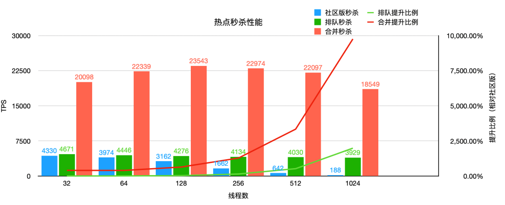

测试数据均为sysbench模拟标准库存扣减模型进行的压测数据。

  

首先对秒杀场景进行分析，抽象出了它的事务模型。下面所示为最经典的库存扣减模型：

1. begin;
2. insert into inventory_log value (...);

-- 插入库存修改的流水表

3. update inventory set quantity=quantity-1 where sku_id=? and quantity > 0;  

-- 扣减库存表

4. commit;

随着并发数的增加，数据库的update写入性能急剧下降，最终基本处于不可用的状态（TPS约为100-200），出现非常严重的卡顿，下面将依次分析不同方案的性能瓶颈点和解决思路。

  

**3.1 排队****秒杀提升点**

合并秒杀版本重点解决了性能下降问题，将秒杀性能维持在一个性能基本不变的状态。

  

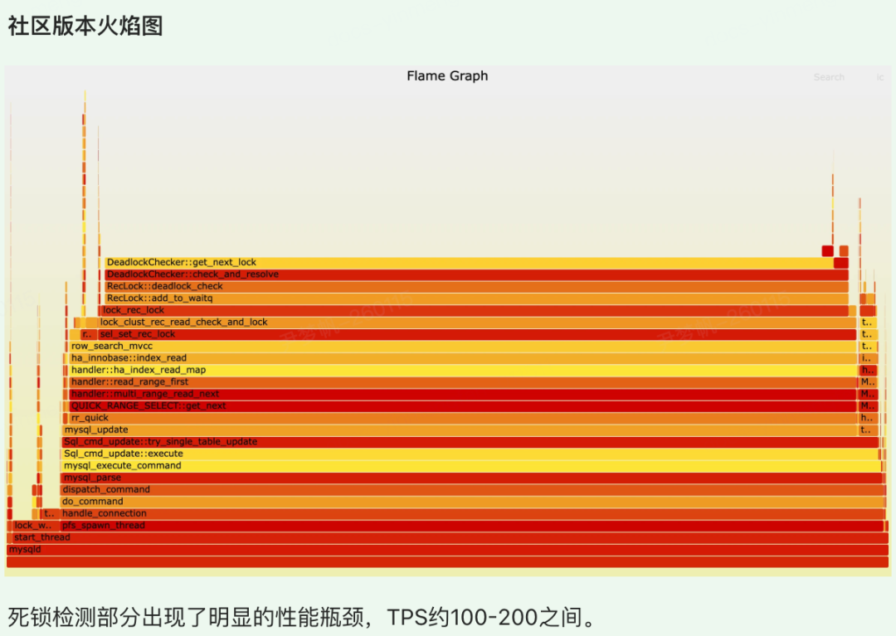

  

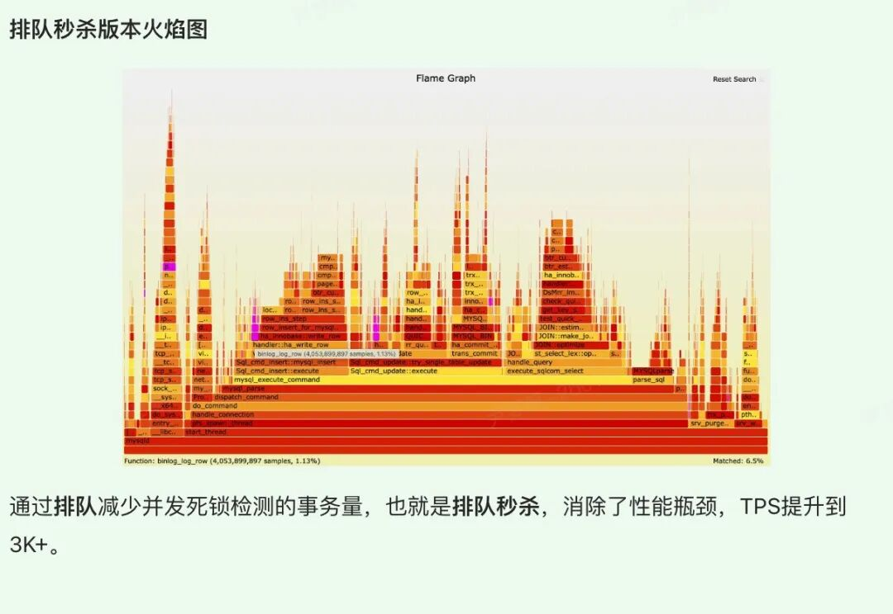

  

左右滑动查看

  

**3.2 合并****秒杀提升点**

再次分析上面的库存扣减模型，每个事务都是（begin；insert；update；commit）这种格式。那么insert是插入不同的行（主键不一样），所以可以并发，但是update是对同一行的改写，无法并发，红色的标识为临界区（行锁）。所以性能的瓶颈点在update同一行的修改上，秒杀V2将解决该瓶颈点。

  

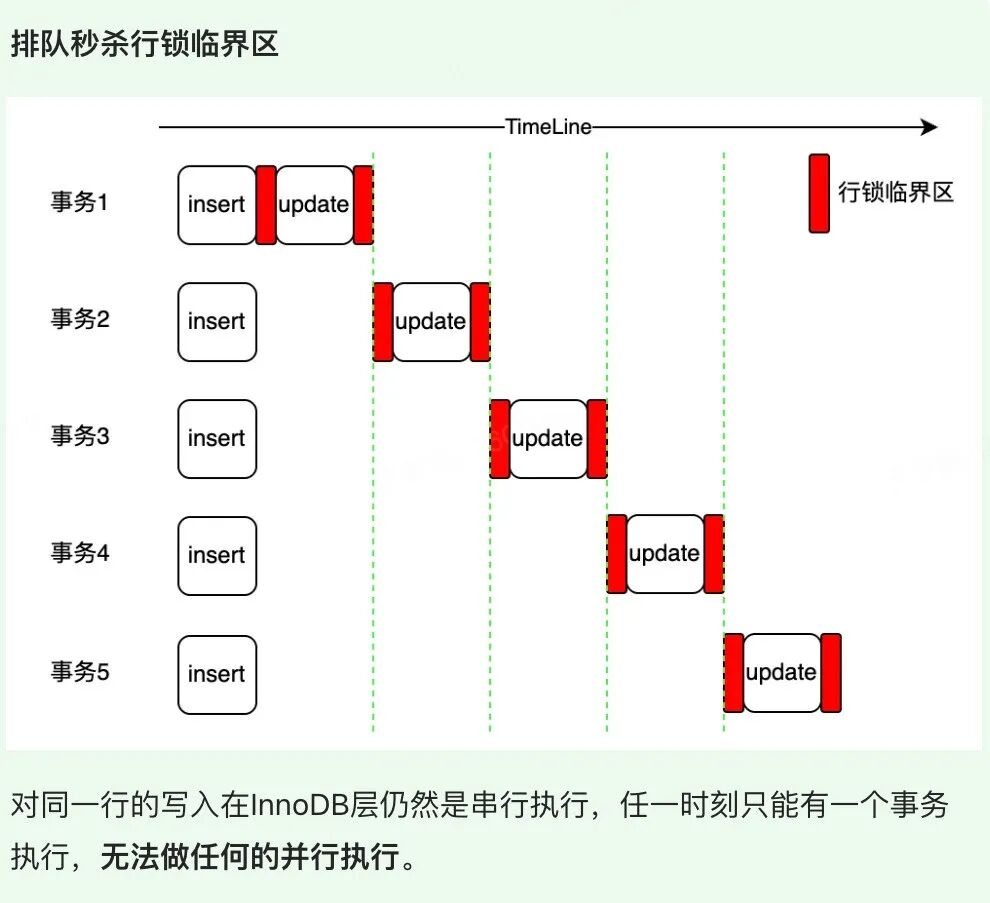

  

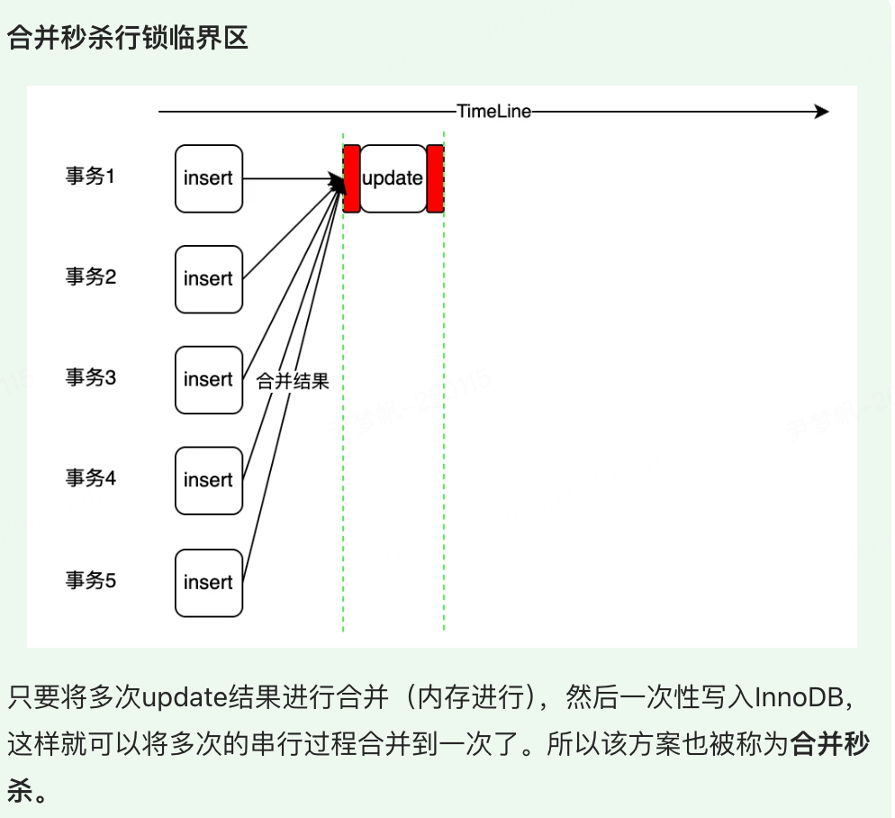

左右滑动查看

  

  

**3.3 方案总结**

将上述方案的瓶颈点和解决思路整合如下对比所示，直观反映了各方案的优化思路。

  

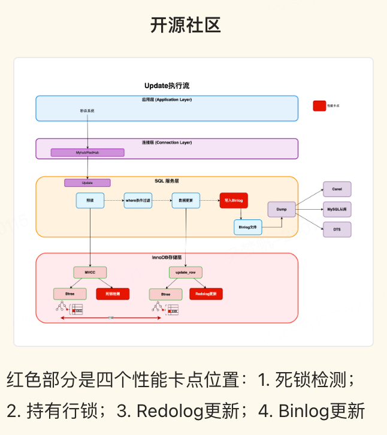

  

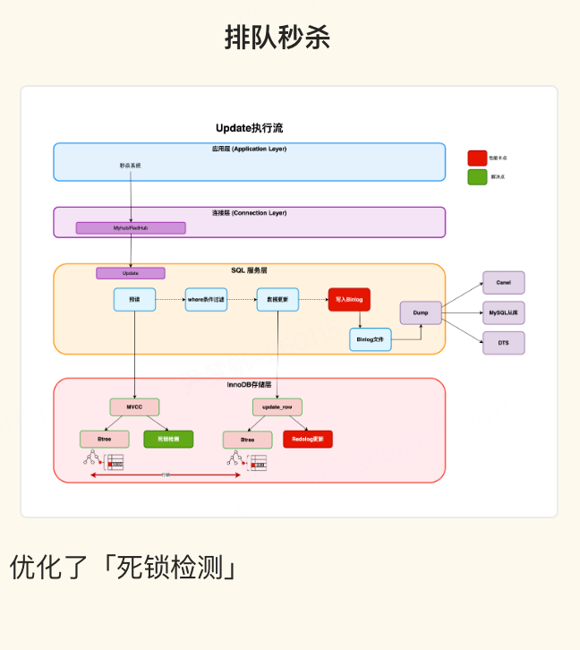

  

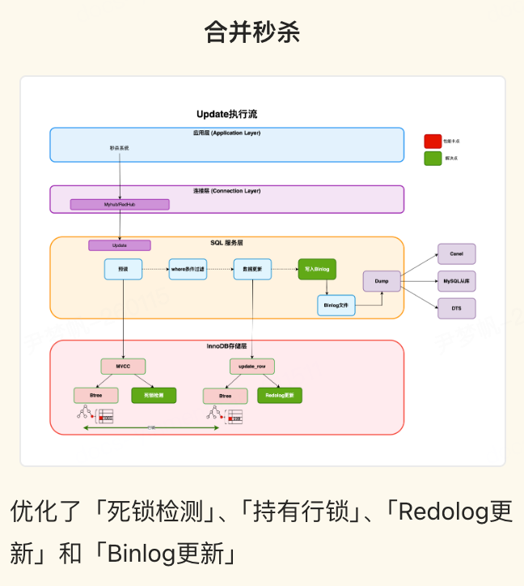

  

左右滑动查看

  

  

合并秒杀将多个事务 SQL 合并到一个事务进行提交，修改了MySQL的事务模型，必然涉及到MySQL事务系统、锁系统、Binlog系统等模块的修改。合并秒杀方案提供了如下优势：

  

1. **生态组件无感知：**将改动内容收敛到MySQL内核，输出的 Binlog内容和格式没有变化，对于DTS/Canel等组件无感知，避免了联动组件升级
2. **内核升级无感知：**不修改InnoDB格式，不影响版本兼容性和版本回退
3. **业务SQL无修改：**和排队秒杀版本SQL语法兼容，可以动态开关。业务/DBA可以随时将合并秒杀退化到排队秒杀，也可以随时开启。可以同时将合并秒杀，排队秒杀，无秒杀在一个数据库同时跑起来，减少业务迁移成本。

  

**一句话总结本方案：**合并秒杀通过Leader预读取库存数据写入缓存，在缓存中进行Follower库存数据合并扣减，最后Leader一次性将合并数据写入存储引擎，提升了写入性能。

  

**4.1 缓存可见性**

为了合并秒杀，要解决如下两个问题：

1. 数据的可见性：目前MySQL的数据是线程可见的，这样最方便。但是合并秒杀是需要多个线程之间共享数据的。
2. 数据一致性问题：Leader-Follower的数据同步问题，要做好状态的流转。

  

**4.1.1 数据可见性****  
**

为了解决以上问题，按照表维度添加了全局缓存，多个线程操作同一张表的结构体访问同一份缓存，缓存的生命周期和表结构是一样的，方便缓存管理。

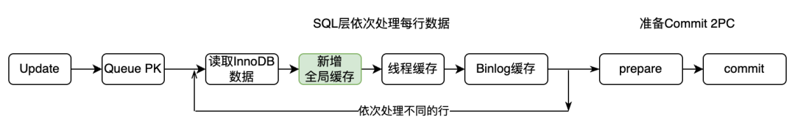

  

**4.1.2 数据一致性**

解决了数据的可见性问题，剩下的核心点就是解决Leader-Follower的数据同步问题，保证数据的一致性。下面一张图系统的展示了一个Leader两个Follower线程是如何配合扣减三次的：

  

1. 首先三个客户端发送了相同的update语句。经过了Queue PK，由于开启了合并秒杀，跳过了排队秒杀过程
2. 三个线程开始抢独占锁，最先抢到的将自己标记为Leader，然后读取InnoDB数据和更新数据，将修改后的数据写入全局缓存。Leader做完了工作，释放独占锁，开始进入收集状态，等待若干毫秒
3. 另外两个Follower开始抢独占锁。抢到的标记为Follower，然后将全局缓存数据写入线程缓存，然后更新线程缓存完成扣减，最后将线程缓存数据再写入全局缓存。释放独占锁，进入等待唤醒状态。在全局缓存中完成Follower的库存扣减
4. 后面的线程依次进入Follower过程，按照读全局缓存->完成扣减->更新全局缓存的过程，依次执行了update语句扣减
5. Leader线程完成了收集，重新申请独占锁，将全局缓存数据作为本组最终扣减的值。开始进入2PC过程完成最终数据提交。Leader完成后会唤醒Follower，所有SQL结束

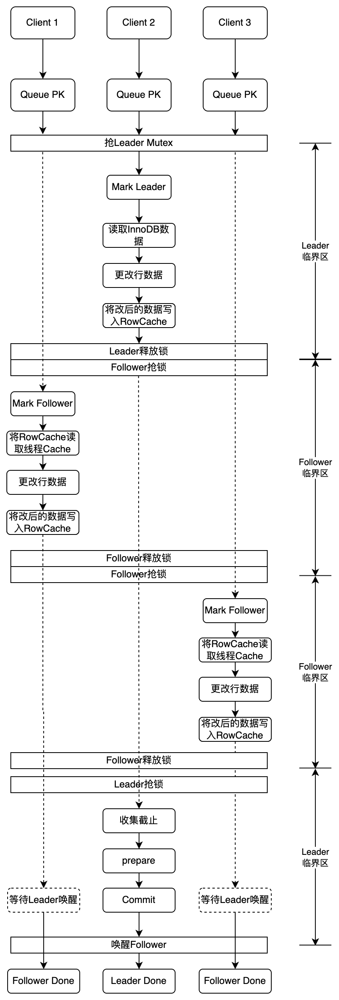

  

**4.2 行****锁极致优化**

上面的过程看起来配合的非常好，是否还有优化空间？

再次回到下面的这张图，将update分为两个步骤，一个是收集更新缓存阶段（phase 1），一个是commit阶段（phase 2）。

如果将多个组提交按照时间串起来，可以看到上一个组必须commit完释放了行锁，才能让下一个组重新申请行锁。如下图所示。所以整个流水线在组内是合并提交的，但是组和组之间是完全的串行。

  

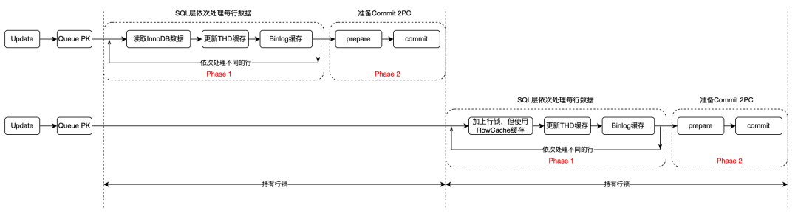

如按照两个阶段分为两个组，那么在第一个组进行commit的时候，第二个组完全可以开始收集，无需等待第一组commit完成。这样整体的执行时间会进一步压缩。以两个组为例，第一个组从1000扣减50为950，那么在第一个组提交950的时候，第二个组可以从950开始扣减。

如下图所示，绿色部分就是节省的时间。

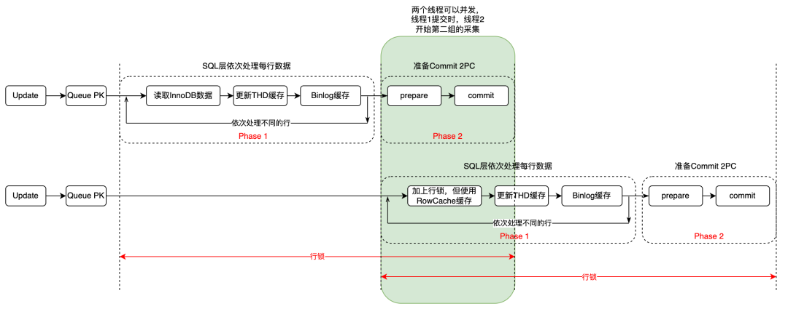

  

**4.3 ****Binlog并行提交**

整个组的Binlog是同一批由Leader统一提交。

  

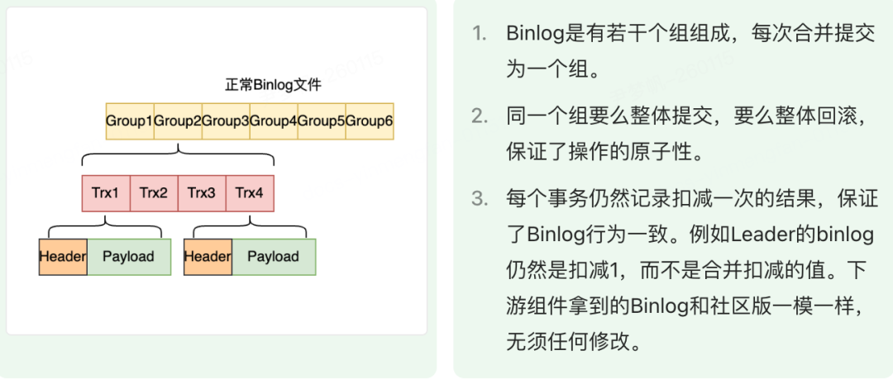

  

**4.4 Crash Recovery优化**

Crash Recovery过程简单来说，先由Binlog生成一个事务集合，然后拿到Redolog进行对比，该提交就提交，该回滚就回滚。

1. 合并秒杀是Leader提交Binlog，将整个组的Binlog都写入
2. Redolog记录的是合并前后的值（例如1000->900)，但是binlog记录的是每个事务的改动（1000->999, 999->998)。所以要回滚Redolog的内容或者提交Redolog的内容，必须要求整个Binlog组的完整性

  

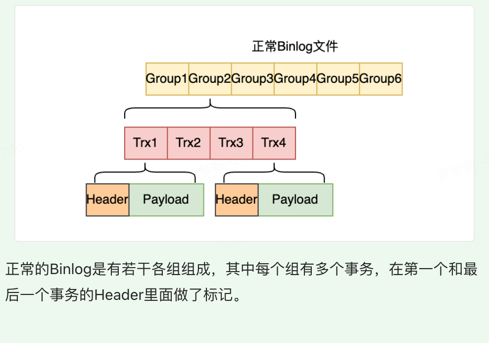

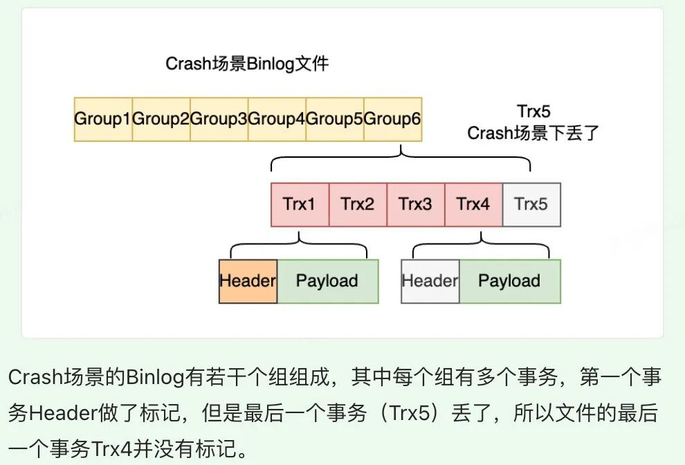

左右滑动查看

  

对于以上两种场景，Crash Recovery需要做好兼容处理。具体的思路如下:

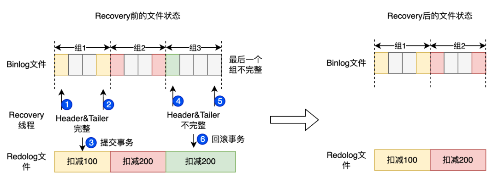

以数据组为单位进行扣减数据的提交和回滚，相对事务粒度更大一些。

  

正如上面所述，在内核中使用的Hint关键字如下：

  

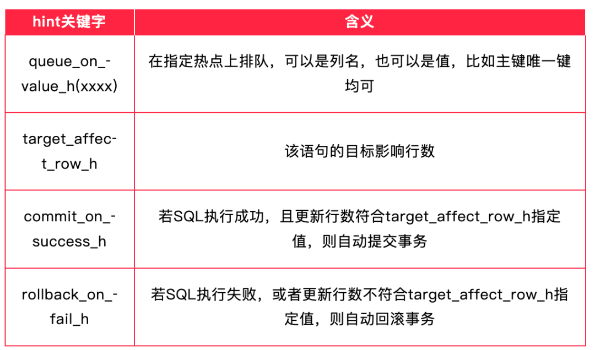

  

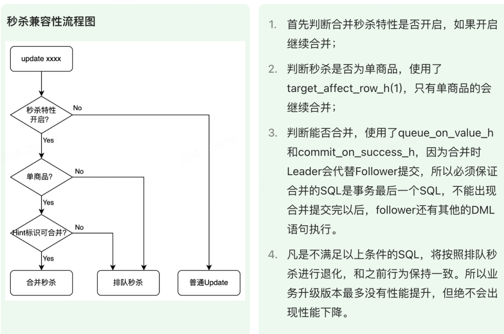

**  
**

  

