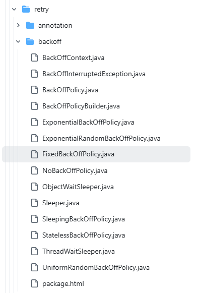

# 典型回答

“退避”（Backoff）是在系统发生失败或异常后，延迟一段时间再重试的一种策略。它的核心思想是：不要立即、频繁地重试，而是给系统一点“喘息”的时间，以避免雪崩、资源耗尽或加剧故障。

这是一个在定时任务，重试任务等等系统中非常重要的东西。

假设你调用一个远程服务失败了，如果不做不退避，就是要立即重试，那么就意味着下游服务就要被一直怼，那么就会加剧他的问题，直至崩溃。

而如果使用一定的退避的话，就相当于给对方一点喘息时间、而且也能让自己减少一些无用的调用，提高整体系统的稳定性与容错能力。

在Spring中，其实定义了一些退避策略，给@Retryable注解用的。常见的退避策略有以下几种：

### 不退避（No Backoff）

不退避，就是直接重试，也算是一种策略。。。。。

### **固定退避（Fixed Backoff）**

每次重试等待相同的时间。这种策略，用起来很简单，但是无法应对持续性故障（比如对方需要更长时间恢复）

### **指数退避（Exponential Backoff）**

等待时间按指数增长：`delay = base * (2^n)`，其中 `n` 是重试次数。例如：100ms → 200ms → 400ms → 800ms → ...

很多MQ的消息的消费失败的重投，用的就是这种策略，失败次数越多，下次投递的时间窗口就越长。

### 指数随机退避（ExponentialRandomBackOffPolicy）

指数随机退避。它在指数增长的基础上，增加了一个随机因子，可以避免在重试时多个客户端同时发起请求，造成“惊群效应”。

