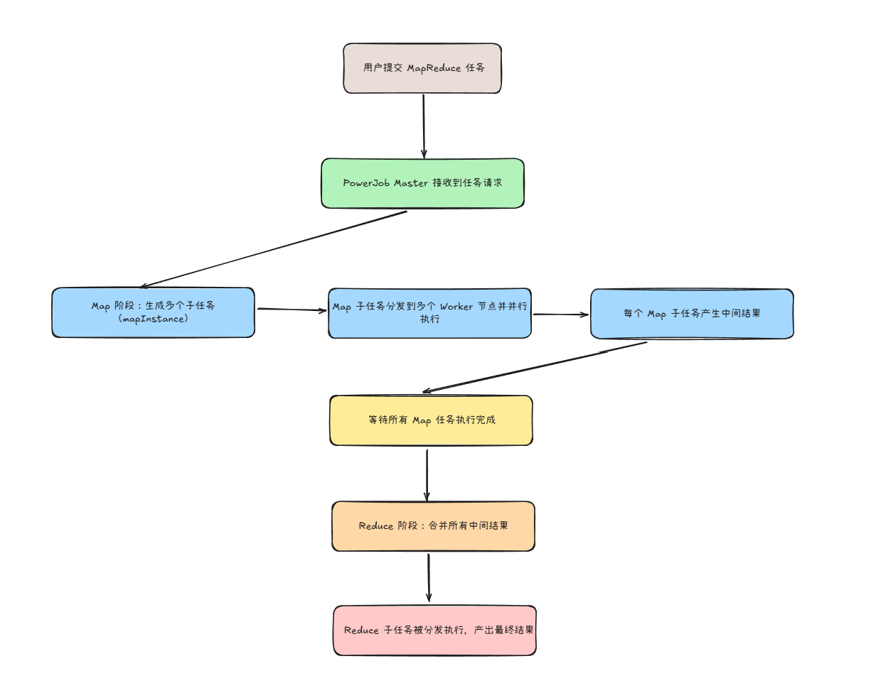

# 典型回答


在PowerJob和Schedulerx中都支持MapReduce动态分片。它其实是借鉴了 Hadoop 的 MapReduce 思想 —— **将任务拆分成多个子任务（Map 阶段），并最终将子任务的结果聚合处理（Reduce 阶段）**，支持数据驱动的分布式计算。  


他的主要流程如下：





**相比于xxl-job的静态分片任务，他不需要事先设定好分片数，而是根据你输入的数据动态生成子任务，然后再把这些子任务均分给你的具体的执行的实例。这样一来，他就能更好的扩展性，只要你新加了机器，就可以立刻被利用上，而不需要调整分片数。而且不需要把分片数和节点数绑定，不会导致资源的浪费或者不足。**


想要在PowerJob中使用mapReduce任务，要继承 `MapReduceProcessor` 类，实现 `map` 和 `reduce` 方法：


```bash
@PowerJob("MapReduceExampleJob")
@Slf4j
public class MapReduceExampleJob extends MapReduceProcessor {

    @Override
    public ProcessResult process(TaskContext context) throws Exception {
        // 根任务逻辑（可选）
        return super.process(context);
    }

    // Map 阶段：拆分任务
    @Override
    protected List<SubTask> map(TaskContext taskContext) {
        // 动态生成子任务（示例：拆分10个子任务）
        List<SubTask> subTasks = new ArrayList<>();
        for (int i = 0; i < 10; i++) {
            subTasks.add(SubTask.create("subTask-" + i, String.valueOf(i)));
        }
        return subTasks;
    }

    // Reduce 阶段：汇总结果
    @Override
    protected ProcessResult reduce(TaskContext taskContext, List<TaskResult> taskResults) {
        // 统计子任务结果
        int successCount = 0;
        for (TaskResult result : taskResults) {
            if (result.isSuccess()) successCount++;
        }
        log.info("子任务成功数：{}/{}", successCount, taskResults.size());
        return new ProcessResult(true, "汇总成功");
    }
}
```


然后控制台上任务类型选择MapReduce就行了。不需要自己手动配置分片数。

