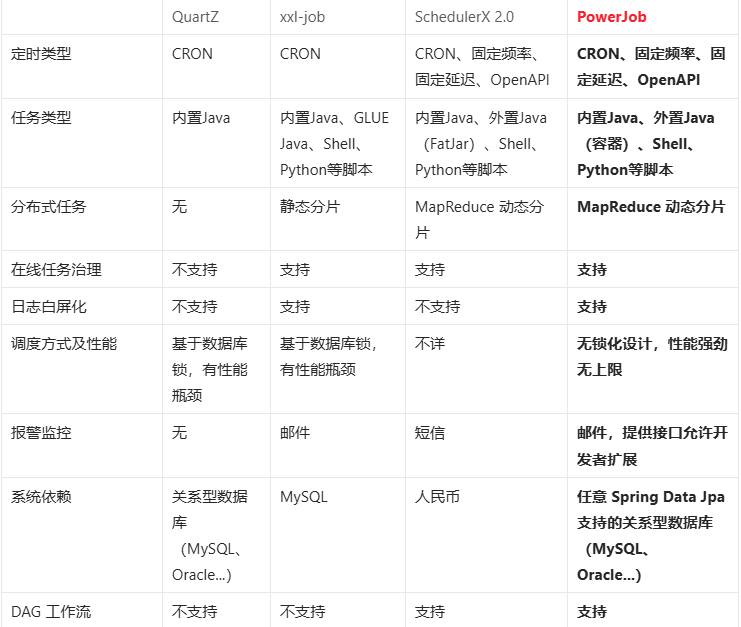

# 典型回答

PowerJob是基于java开发的企业级的分布式任务调度平台，与xxl-job一样，基于web页面实现任务调度配置与记录，使用简单，上手快速。

以下是powerjob自己的文档中，关于几种常见的定时任务的区别：

可以看到，相比于常见的XXL-JOB，有以下几个优势：

1、他支持的定时任务类型更多一些，包括固定频率，固定延时等。

2、他支持MapReduce动态分片，而不是像XXL-JOB一样只支持静态分片

3、他是无锁化设计，相比于XXL-JOB依赖数据库悲观锁性能更好一些。

4、支持的数据库比较多

5、支持DAG工作流

据说（我之前好像看过作者自己写的博客），这个作者是之前到阿里实习，然后发现内部的schedulerx挺强的，离职之后，就参考着自己写了个power-job出来。。。所以不看，大部分功能和schedulerx还是比较像的。

