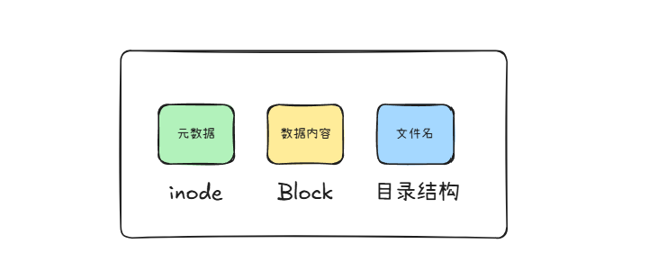
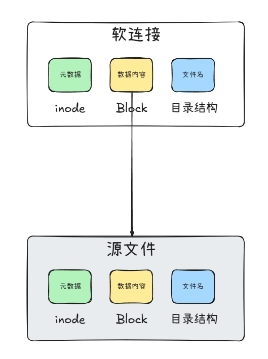
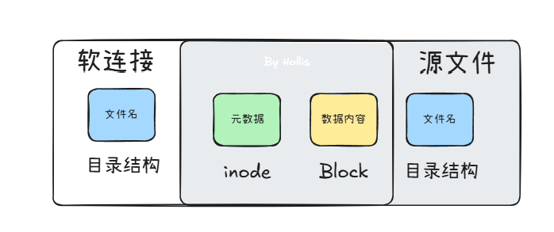

# 典型回答


在 Linux 文件系统中，一个文件由多个部分组成，主要可以分为以下几部分：

+ **数据内容（Data Blocks）**
+ **元数据（Metadata，存储在 **`**inode**`** 中）**
+ **文件名（存储在目录结构中）**
+ 权限信息
+ 时间信息
+ 扩展属性（Extended Attributes）


以上，比较关键的就是**数据内容、元数据和文件名三部分。**




### inode


上面提到一个重要的属性——inode，在 Linux/Unix 文件系统中，文件是通过 `inode` 进行管理的。**当你创建一个文件时，系统会为它分配一个 **`**inode**`**，这个 **`**inode**`** 记录了文件的各种信息**（但不包括文件名）。  所以，我们可以认为`inode`（索引节点）是文件的“身份信息”，用于存储文件的元数据。每个文件都有一个唯一的 `inode` 号，它指向文件存储的数据块。  


每个 `inode` 主要存储以下信息：

+ **文件类型**（普通文件、目录、符号链接等）
+ **权限**（如 `rwxr-xr-x`）
+ **文件所有者（UID）**
+ **文件所属组（GID）**
+ **文件大小**
+ **创建时间（ctime）、修改时间（mtime）、访问时间（atime）**
+ **文件的硬链接数**
+ **文件数据所在的磁盘块指针**
+ **inode 号**（唯一标识该文件）

**注意**：inode **不存储文件名**，文件名存储在目录结构中，而目录本质上是文件名到 inode 号的映射。


在 Linux 中，可以使用 `ls -i` 命令查看文件的 `inode` 号：  


```plain
ls -li
```


### 软链接和硬链接


Linux 链接分两种，一种被称为硬链接（Hard Link），另一种被称为符号链接（Symbolic Link）。默认情况下，ln 命令产生硬链接。


```plain
# 创建硬链接
ln original.txt hardlink.txt

# 创建软链接
ln -s original.txt softlink.txt
```


**软连接可以理解为 Windows 中的“快捷方式”，它本身是一个特殊的文件，存储的内容是目标文件的路径。当我们访问软连接时，系统会自动跳转到目标文件。**

****

** **


**硬链接可以理解为“同一个文件的不同名称”。它与原文件共享相同的 **`**inode**`** 号（扩展知识有介绍），因此它们实际上是同一个文件，数据存储在同一位置。  **

****



所以，<font style="background-color:#FBDE28;">硬链接与原文件共享同一个 inode 和数据块。不额外占用存储空间，只是增加一个目录结构而已。而软链接拥有自己的 inode，存储的数据内容为目标文件的路径字符串</font>，另外还有以下差别：


1、 软连接可以跨文件系统（不同的磁盘分区）。 硬链接必须在同一个文件系统（不能跨分区）。  

2、 软连接可以指向目录或文件。 硬链接只能指向文件，不能指向目录（为防止循环引用）。

3、 软连接依赖于原文件，如果原文件被删除，软连接会失效（“断链”）。硬链接删除原文件后，其他硬链接仍可访问数据，直到所有硬链接均被删除（inode 引用计数归零）。

4、硬链接的权限、时间戳、所有者等信息与原文件完全一致。软连接拥有自己的权限、时间戳（但访问时继承目标权限）。


| **特性** | **硬链接** | **软链接** |
| --- | --- | --- |
| **本质  ** | <font style="background-color:#FBDE28;">共享相同 </font>`<font style="background-color:#FBDE28;">inode</font>` | <font style="background-color:#FBDE28;">存储目标文件路径  </font> |
| **是否独立** | 否（只是另一个文件名） | 是（一个单独的文件） |
| **跨文件系统** | 不支持 | 支持 |
| **原文件删除** | 仍可访问 | 失效 |
| **链接对象** | 仅文件 | 文件或目录 |
| **inode 共享** | <font style="background-color:#FBDE28;">是</font> | <font style="background-color:#FBDE28;">否（独立 inode）</font> |
| **空间占用** | 不额外占用 | 少量路径存储 |
| **命令示例** | `<font style="background-color:#FBDE28;">ln source hardlink</font>` | `<font style="background-color:#FBDE28;">ln -s source softlink</font>` |


  
 

