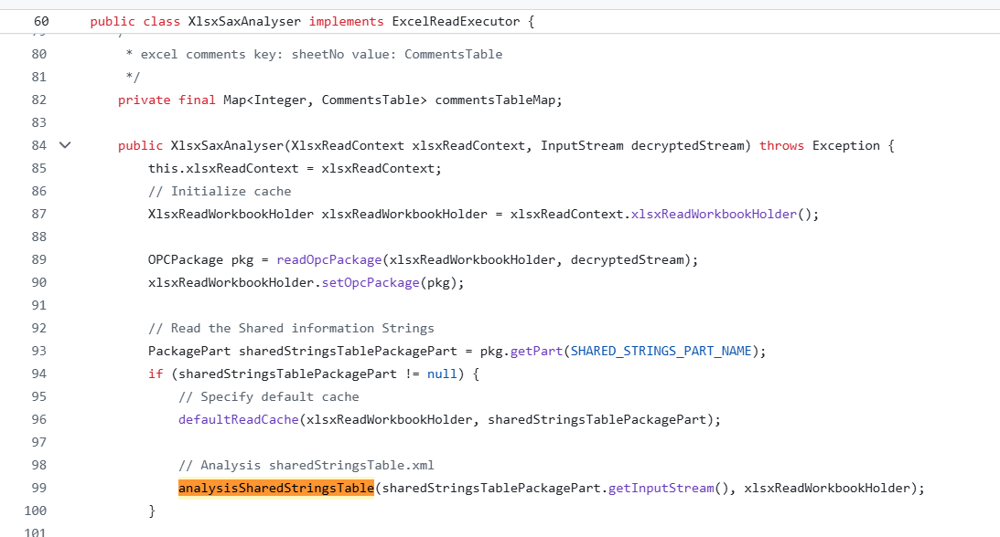
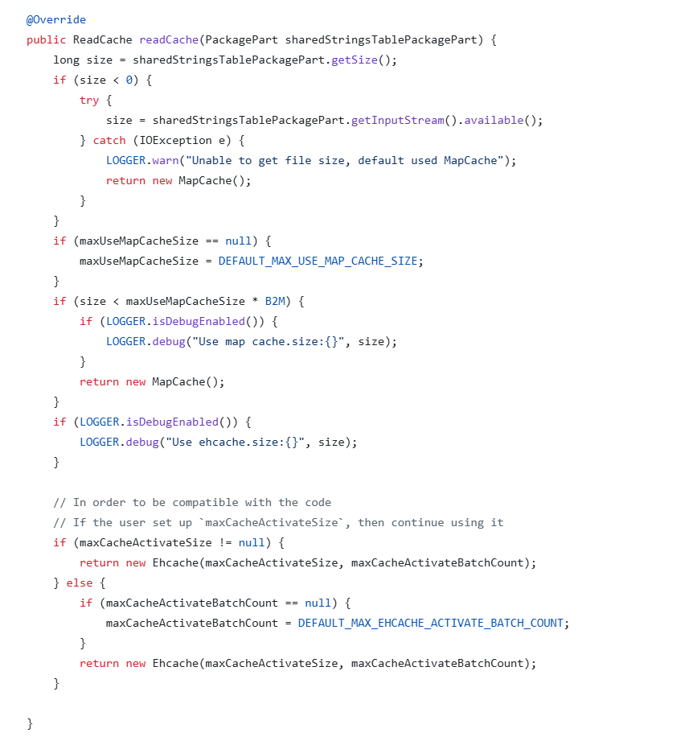

# 典型回答


EasyExcel是一个基于Java的、快速、简洁、解决大文件内存溢出的Excel处理工具。他能让你在不用考虑性能、内存的等因素的情况下，快速完成Excel的读、写等功能。


相比于POI，它有效的解决了内存溢出等问题（处理 100 万行 Excel 时，EasyExcel 内存在 50MB -100M左右，而 POI 可能需 1.5G - 2GB左右），那么他为什么占用内存更小呢？做了哪些特别的设计呢？


EasyExcel 之所以能在处理大型 Excel 文件时保持较低的内存占用，主要归功于其**SAX解析设计（逐行读取+事件机制）**和**磁盘缓存策略**。（本文主要介绍EasyExcel的文件读取占用内存小的原因，文件写入其实和POI的 SXSSFWorkbook  原理一样的。直接看[]() 就可以了）


> PS：本文是基于[https://github.com/alibaba/easyexcel/tree/master](https://github.com/alibaba/easyexcel/tree/master) 的代码解读的，这个项目的作者后来又出了一个fastexcel，我大致看了下，相关代码差别不大。
>


### SAX解析（核心）


首先，我们看一下EasyExcel官网上是有这么一段描述的：


> <font style="color:rgb(31, 35, 40);">Java解析、生成Excel比较有名的框架有Apache poi、jxl。但他们都存在一个严重的问题就是非常的耗内存，poi有一套SAX模式的API可以一定程度的解决一些内存溢出的问题，但POI还是有一些缺陷，比如07版Excel解压缩以及解压后存储都是在内存中完成的，内存消耗依然很大。</font>
>
>   
<font style="color:rgb(31, 35, 40);">easyexcel重写了poi对07版Excel的解析，一个3M的excel用POI sax解析依然需要100M左右内存，改用easyexcel可以降低到几M，并且再大的excel也不会出现内存溢出；03版依赖POI的sax模式，在上层做了模型转换的封装，让使用者更加简单方便</font>
>


那么这个可以解决内存溢出问题的SAX是啥呢？


<font style="color:rgb(64, 64, 64);">SAX（</font>**<font style="color:rgb(64, 64, 64);">S</font>**<font style="color:rgb(64, 64, 64);">imple </font>**<font style="color:rgb(64, 64, 64);">A</font>**<font style="color:rgb(64, 64, 64);">PI for </font>**<font style="color:rgb(64, 64, 64);">X</font>**<font style="color:rgb(64, 64, 64);">ML）是一种基于</font>**事件驱动**<font style="color:rgb(64, 64, 64);">的XML解析模型，与DOM（Document Object Model）</font> 这种将整个 XML 加载进内存构建树状结构完全不同<font style="color:rgb(64, 64, 64);">。它的核心设计理念是</font>**<font style="color:rgb(64, 64, 64);">逐行</font>****边读边处理**<font style="color:rgb(64, 64, 64);">，</font>**不保留整个文档结构，**是一种**流式处理**方式<font style="color:rgb(64, 64, 64);">。</font>

<font style="color:rgb(64, 64, 64);"></font>

当你用 SAX 解析器读取 XML 文档时，他会触发一系列“事件”（如开始标签、文本内容、结束标签），并回调你实现的处理器去处理这些事件。  这些事件有：

+ `startDocument()`：文档开始
+ `startElement()`：遇到开始标签（如 `<row>`）
+ `characters()`：读取标签内的文本
+ `endElement()`：遇到结束标签（如 `</row>`）
+ `endDocument()`：文档结束


<font style="color:rgb(64, 64, 64);">在EasyExcel中，有一个</font>[XlsxSaxAnalyser](http://github.com/alibaba/easyexcel/blob/master/easyexcel-core/src/main/java/com/alibaba/excel/analysis/v07/XlsxSaxAnalyser.java)<font style="color:rgb(64, 64, 64);">，他就是基于 Apache POI 的 </font>`**<font style="color:rgb(64, 64, 64);background-color:rgb(236, 236, 236);">XSSFReader</font>**`<font style="color:rgb(64, 64, 64);"> + SAX 事件模型解析 XML的。</font>

<font style="color:rgb(64, 64, 64);"></font>

<font style="color:rgb(64, 64, 64);">其中的核心流程如下：</font>

```sql
public void execute() {
    for (ReadSheet readSheet : sheetList) {
        // 仅处理匹配的工作表（按需加载）
        readSheet = SheetUtils.match(readSheet, xlsxReadContext);
        if (readSheet != null) {
            try {
                xlsxReadContext.currentSheet(readSheet);
                // 核心：SAX流式解析工作表数据
                parseXmlSource(sheetMap.get(readSheet.getSheetNo()), 
                    new XlsxRowHandler(xlsxReadContext));
            } catch (...) { ... }
        }
    }
}
```


通过 `sheetMap` 按索引获取输入流，不预加载整个文件。然后看parseXmlSource这个SAX的核心逻辑，这里注意一下parseXmlSource的入参<u>XlsxRowHandler</u>。

<font style="color:rgb(139, 139, 139);"></font>

```sql
private void parseXmlSource(InputStream inputStream, ContentHandler handler) {
    SAXParserFactory saxFactory = SAXParserFactory.newInstance();
    // 禁用危险特性（安全加固）
    saxFactory.setFeature("http://apache.org/xml/features/disallow-doctype-decl", true);
    saxFactory.setFeature("http://xml.org/sax/features/external-general-entities", false);
    // 创建轻量级解析器
    SAXParser saxParser = saxFactory.newSAXParser();
    XMLReader xmlReader = saxParser.getXMLReader();
    xmlReader.setContentHandler(handler); // 绑定自定义处理器
    xmlReader.parse(new InputSource(inputStream)); // 流式解析
}
```


这个<u>XlsxRowHandler</u>是一个ContentHandler，他会一行一行处理数据， 每次遇到 `<row>` 开始就初始化新行数据容器，`</row>` 结束后就触发处理，随后丢弃，保证了内存中只存在**当前行的数据**。  


源码在这：[https://github.com/alibaba/easyexcel/blob/master/easyexcel-core/src/main/java/com/alibaba/excel/analysis/v07/handlers/sax/XlsxRowHandler.java](https://github.com/alibaba/easyexcel/blob/master/easyexcel-core/src/main/java/com/alibaba/excel/analysis/v07/handlers/sax/XlsxRowHandler.java)


### 磁盘缓存策略


在下面的文章中，我们介绍过Excel加压后的结构


[✅什么是POI，为什么它会导致内存溢出？](docs/文件处理/✅什么是POI，为什么它会导致内存溢出？.md)


在xlsx文件中，为了提高存储效率，**单元格中的字符串不是直接存储在单元格中，而是被集中存储在一个名为“sharedStrings.xml”的文件中**。单元格中存储的是这个字符串在共享字符串表中的索引。这样，**重复的字符串只需要存储一次**，可以减小文件大小。


把xlsx解压之后，在xl目录下可以找这个sharedStrings文件。


```plain
xl/
├── worksheets/sheet1.xml  # 工作表数据（存储字符串索引）
└── sharedStrings.xml      # 共享字符串池（存储实际文本）
```


而在前面说过的XlsxSaxAnalyser中我看到了和sharedStrings有关的操作，如下：





他的实现如下：


```sql
private void analysisSharedStringsTable(
    InputStream sharedStringsTableInputStream,  // sharedStrings.xml 的输入流
    XlsxReadWorkbookHolder xlsxReadWorkbookHolder) {
    
    // 关键：获取动态选择的缓存策略（内存/磁盘）
    ReadCache cache = xlsxReadWorkbookHolder.getReadCache();
    
    // 创建SAX处理器（流式解析共享字符串）
    ContentHandler handler = new SharedStringsTableHandler(cache);
    
    // 流式解析XML（不加载整个文件）
    parseXmlSource(sharedStringsTableInputStream, handler);
    
    // 标记缓存就绪（后续可查询）
    cache.putFinished(); 
}

```


这里有一个getReadCache()动作，获取动态选择的缓存策略，这里面为了防止内存的泄漏，会根据文件大小动态选择缓存介质，如下面的代码 ，可以看到有在用到Ehcache这种可以基于磁盘的存储。也就是说，默认使用内存缓存 （`MapCache`），如果超过阈值时切换至 `Ehcache` 将数据写入临时文件，释放内存。




