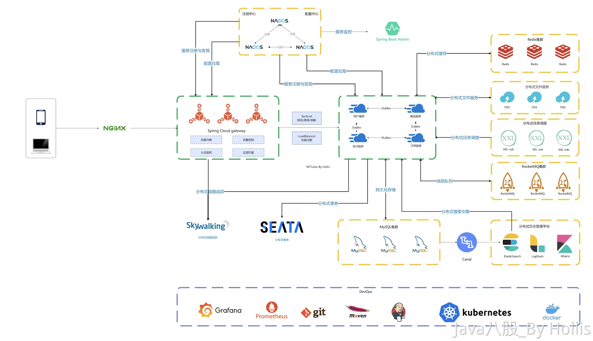

# 典型回答

这个问题，很宽泛，很多人不知道该咋回答。其实，架构分好几种，面试很工作中经常聊的就是以下这几个

+ 业务架构
+ 技术架构
+ 部署架构
+ 数据架构

### 业务架构（首选）

这个是最经常聊的，所谓业务架构其实就是项目的业务功能模块、业务流程。也是面试的时候重点主要应该讲的。

一般需要包括的内容：

+ 核心业务域或者模块或者微服务的划分（如用户、订单、商品、支付）
+ 业务流程图（如下单、退款、发货流程）
+ 业务用例或场景分析

一般建议大家通过一个核心流程来介绍，比如说我的[数藏项目]我会这么介绍他的业务架构：

这个项目是一个微服务的项目，根据业务功能模块，我们划分出来了网关、用户、交易、订单、商品、区块链、支付等等核心模块，其中比较重要的就是交易、订单、商品、支付等模块。

拿用户的一次下单操作来举例，最开始流量会先到网关，网关经过负载均衡之后会到交易模块，交易模块会做一些前置校验，之后开始和商品、订单等模块做交互，去扣减库存和创建订单等等的。

### 技术架构（首选）

技术架构其实就是聊技术了，主要是你的技术选型、通信方式、主要的技术栈等等，需要包括：

+ 技术栈选型（Java/Spring Cloud、Go、Node.js 等）
+ 系统分层（如表示层、服务层、数据访问层）
+ 服务间调用方式（REST、RPC、MQ）
+ 架构模式（微服务、DDD、CQRS、Serverless）
+ 中间件选型（缓存、消息队列、搜索、网关等）

还是拿说我的[数藏项目]我会这么介绍他的技术架构：

这是一个基于Spring Cloud搭建的分布式系统，通过SpringCloud Gateway我们搭建了一个统一的网关，然后各个微服务之间我们采用Dubbo做RPC的调用，异步消息这部分我们用了RocketMQ，存储的话主要用到了Redis做缓存，MySQL做持久化，定时任务采用的时XXL-JOB来实现的。项目中的一些海量数据的查询使用到了ElasticSearch来做的，里面的数据是通过Canal做同步的。还有一些限流相关的我们用了Sentinel实现。分布式事务这部分我们用了Seata作为分布式事务的协调组件。当然，项目中还有Nacos，包括我们的Gateway、Dubbo、Seata、Sentinel等等都依赖他来做注册中心和配置中心的。

### 部署架构（非主动问不用提）

所谓部署架构，其实就是介绍你的项目是如何部署的。主要需要包括

+ 云/本地部署结构（如公有云、私有云、K8s）
+ 微服务部署情况
+ 主从/集群架构（如数据库、Redis）
+ 灰度发布、自动扩缩容

比如你是否使用了容器，比如k8s等，然后是多少个微服务，多少台机器，是否用异地多活，多机房之类的，比如一些关键的中间件，是否有集群，主从等等，如Redis，MySQL，Kafka等等。

这个面试时的问的比较少的，不主动问的话不要聊，你容易聊不明白，这个偏运维了。

### 数据架构（非主动问不用提）

数据架构其实就是你**系统中的数据结构、数据流、存储方式**。比如

+ 数据的存储形式，如Redis、ES、mysql等
+ 是否有分库分表、读写分离策略
+ 是否有数据仓库、数据湖、数据中台
+ 实时处理（Flink）、离线分析（Hive/Spark）
+ 数据资产治理（血缘、元数据、权限）

重点的一些包括数据的存储，比如哪些数据在数据库，哪些数据在redis，哪些又用了ES。然后是否有数仓，包括实时数仓、离线数仓等，以及你的一些实时处理，比如Flink的链路，离线的任务如spark啥的。

